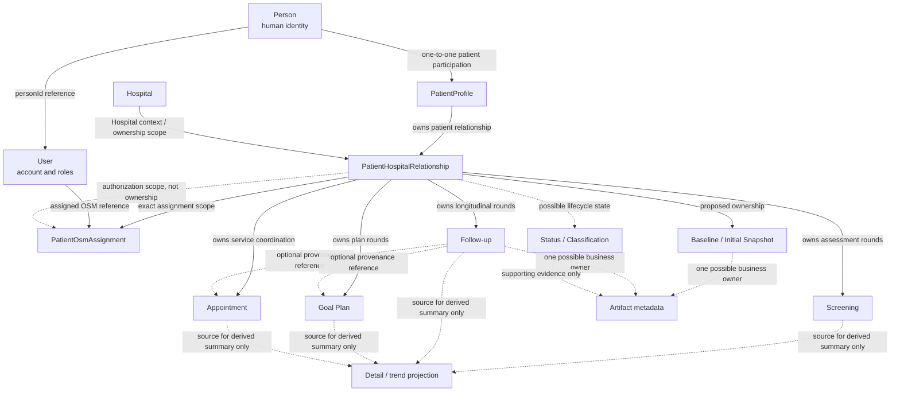

# Phase 10A — Patient Profile / Baseline / Status Tracking Requirements & Domain Boundary Analysis

> **Status:** Phase 10A is an analysis and provisional-contract phase. It is not customer-approved clinical behavior. This phase adds no Prisma model, migration, Server Action, route, UI, storage provider, upload flow, or production feature.

This document records what can be supported by observed legacy behavior and the current DEMI architecture before Phases 10B.0–10D.0 are implemented. Evidence is labelled as follows:

- **Direct evidence** — observed in a source file, query, route, schema, or accepted phase contract.
- **Current contract** — already established by the rewritten DEMI architecture or a completed phase.
- **Inference** — a bounded interpretation that explains evidence but is not a confirmed business requirement.
- **Provisional proposal** — the smallest reversible direction recommended for a working prototype.
- **Open requirement** — a customer or owner decision that must not be invented by implementation.

## 1. Objective

Phase 10A resolves the ownership boundary between:

```text
Person
    → real human identity
User
    → application/authentication account
PatientProfile
    → patient-domain information that is not merely authentication
PatientHospitalRelationship
    → one Hospital-specific patient/care relationship
Baseline / Initial Snapshot
    → a possible explicit starting-state record
Follow-up
    → an existing relationship-scoped longitudinal observation
Status / Classification
    → lifecycle state, event, classification, evidence, or projection depending on the confirmed meaning
Artifact Metadata
    → a bounded reference to evidence owned by one concrete business record
```

The core conclusion is that the legacy patient detail area is a UI aggregation, not a single authoritative domain record. Legacy forms put demographics, Hospital context, measurements, screening results, follow-up observations, and images next to each other, but that proximity does not establish common ownership. Phase 10 keeps those boundaries explicit and leaves unresolved clinical meanings open.

## 2. Sources inspected

### 2.1 Current DEMI requirements and architecture

- [Project context](../CONTEXT.md)
- [Architecture baseline](../architecture/DEMI_ARCHITECTURE_BASELINE.md)
- [ADR-0001 — Person and User identity](../adr/0001-person-and-user-identity.md)
- [ADR-0002 — Role, Capability, and Scope authorization](../adr/0002-role-capability-scope-authorization.md)
- [ADR-0004 — Patient provisioning and activation](../adr/0004-patient-provisioning-and-activation.md)
- [ADR-0005 — Server-side application boundary](../adr/0005-server-side-application-boundary.md)
- [ADR-0006 — Transactional business operations](../adr/0006-transactional-business-operations.md)
- [ADR-0007 — Client transport and application services](../adr/0007-client-transport-and-mobile-ready-architecture.md)
- [ADR-0008 — Workforce provisioning and activation](../adr/0008-workforce-provisioning-and-activation.md)
- [Phase 5A — Patient provisioning requirements](./PHASE_5A_PATIENT_PROVISIONING.md)
- [Phase 5B.1 — Patient provisioning core](./PHASE_5B1_PATIENT_PROVISIONING_CORE.md)
- [Phase 6A — Patient access and assignment requirements](./PHASE_6A_PATIENT_ACCESS_AND_ASSIGNMENT.md)
- [Phase 6B.1 — Patient directory](./PHASE_6B1_PATIENT_DIRECTORY.md)
- [Phase 6B.2 — Patient–OSM assignment](./PHASE_6B2_PATIENT_OSM_ASSIGNMENT.md)
- [Phase 7A — Screening requirements](./PHASE_7A_SCREENING_REQUIREMENTS.md)
- [Phase 7B.0 — Screening working prototype](./PHASE_7B0_SCREENING_WORKING_PROTOTYPE.md)
- [Phase 8A — Goals and Activity Plan requirements](./PHASE_8A_GOALS_AND_ACTIVITY_PLAN_REQUIREMENTS.md)
- [Phase 8B.0 — Goals and Activity Plan working prototype](./PHASE_8B0_GOALS_AND_ACTIVITY_PLAN_WORKING_PROTOTYPE.md)
- [Phase 9A — Appointment and Follow-up requirements](./PHASE_9A_APPOINTMENT_AND_FOLLOWUP_REQUIREMENTS.md)
- [Phase 9B.0 — Appointment working prototype](./PHASE_9B0_APPOINTMENT_WORKING_PROTOTYPE.md)
- [Phase 9C.0 — Follow-up / Progress working prototype](./PHASE_9C0_FOLLOWUP_PROGRESS_WORKING_PROTOTYPE.md)

### 2.2 Current implementation inspected

- [Current Prisma schema](../../prisma/schema.prisma): `Person`, `User`, `PatientProfile`, `PatientHospitalRelationship`, `PatientOsmAssignment`, `ScreeningAssessment`, `PatientGoalPlan`, `PatientAppointment`, `PatientFollowup`, `PatientFollowupActivityProgress`, and `AuditEvent`.
- [Patient directory query service](../../src/modules/patient-directory/services/patient-directory-query-service.ts): relationship-scoped access and the minimal directory/detail projection.
- [Patient–OSM assignment query service](../../src/modules/patient-assignment/services/patient-osm-assignment-query-service.ts): exact relationship lookup and current-assignment projection.
- [Actor context service](../../src/modules/auth/services/actor-context-service.ts): server-resolved account, roles, direct Hospital memberships, and OSM–Hospital relationships.
- [Authorization policy](../../src/modules/auth/policies/authorization.ts): server-side, fail-closed Role + Capability + Scope primitives.
- [Follow-up policy](../../src/modules/followups/policies/followup-policy.ts), [Follow-up query service](../../src/modules/followups/services/followup-query-service.ts), and [Follow-up service](../../src/modules/followups/services/followup-service.ts): relationship ownership, exact OSM assignment, immutable rounds, optional Appointment/Goal references, and bounded projections.
- [Audit service](../../src/modules/audit/services/audit-service.ts): schema validation and opaque structural audit metadata.
- [Current patient relationship detail page](../../app/app/patients/%5BrelationshipId%5D/page.tsx): the current minimal patient detail shell and links to existing domains.

### 2.3 Legacy repository and evidence boundary

The legacy repository was inspected at pinned commit [`7a5510ee1cb5c55b62ad62b0d49bbaa8295d228e`](https://github.com/raviut-max/demi-plus-web-v2/tree/7a5510ee1cb5c55b62ad62b0d49bbaa8295d228e). Relevant evidence includes the patient registration, edit, detail, baseline, status-tracking, follow-up, screening, and Supabase query files listed in Section 3.

The legacy checkout did not provide a committed SQL schema or storage-policy definition that would establish stronger ownership, retention, or authorization rules. Client-side role checks, hierarchy-shaped selectors, direct Supabase writes, and signed URLs are therefore treated as historical behavior evidence only—not as target architecture or authority.

## 3. Legacy behavior inventory

The table records observed behavior, not requirements. Where the same concept is implemented inconsistently, the inconsistency is retained.

| Evidence | Legacy path / symbol | Observed behavior and data | Actor using it | Lifecycle / mutation behavior | Authority status and ambiguity |
| --- | --- | --- | --- | --- | --- |
| E10-01 | [`app/admin/patients/new/page.tsx`](https://github.com/raviut-max/demi-plus-web-v2/blob/7a5510ee1cb5c55b62ad62b0d49bbaa8295d228e/app/admin/patients/new/page.tsx), `formData`, `handleSubmit` | Registration form combines HN, Thai ID, name, birth date, gender, contact, address/geography, emergency contact, occupation/education, Hospital/coach selection, and health-like values such as weight, height, waist, blood sugar, HbA1c, diabetes type, notes, PAM, and zone. | Client session/role list includes `admin`, `doctor`, `helper`, and `osm`; Hospital and coach selectors are loaded in the browser. | Direct browser-side registration writes the legacy user/profile records. Some fields are required by the form, others are optional/defaulted. | Direct evidence of one broad form only. It does not prove global ownership, clinical meaning, patient editability, or that defaults are valid health data. |
| E10-02 | [`app/admin/patients/%5Bid%5D/edit/page.tsx`](https://github.com/raviut-max/demi-plus-web-v2/blob/7a5510ee1cb5c55b62ad62b0d49bbaa8295d228e/app/admin/patients/%5Bid%5D/edit/page.tsx) | Edit form exposes identity, HN, birth date, gender, contact, address, emergency/contact, occupation/education, Hospital/coach, and current health-like fields in one mutable screen. | Same client-side role/session pattern. | Direct update of the broad legacy profile; no evidence of append-only history, amendment records, or field-level ownership. | Direct evidence of mutable legacy UI, not evidence that all fields should remain mutable in DEMI. Raw identity/account data is also exposed by the legacy path, which conflicts with the current identity boundary. |
| E10-03 | [`lib/supabase/queries.ts`](https://github.com/raviut-max/demi-plus-web-v2/blob/7a5510ee1cb5c55b62ad62b0d49bbaa8295d228e/lib/supabase/queries.ts): `registerPatient`, `getPatientDetail`, `importPatientsBatch` | Legacy stores a raw patient/user identifier and a broad profile row containing HN, Hospital, demographics, addresses, emergency data, coach, measurements, PAM/zone/current-step defaults, and status-like values. Patient detail reads profile plus account data and Hospital data together. | Browser query helpers accept caller/session data and direct-write fields. | Registration and import use sequential inserts with cleanup on profile failure; edit/delete/restore and clinical updates are separate mutable operations. | Architecture-conflicting legacy persistence. Hierarchy expansion in `getAccessibleHospitalIds` is not accepted DEMI authorization. Broad `*`-style detail projections do not define the new projection contract. |
| E10-04 | [`app/admin/patients/%5Bid%5D/baseline/page.tsx`](https://github.com/raviut-max/demi-plus-web-v2/blob/7a5510ee1cb5c55b62ad62b0d49bbaa8295d228e), `baselineData`, submit handler | Dedicated UI is titled “initial information” / “round 0” and states that the data is a basis for later comparison. It collects weight, waist, blood pressure, DTX, adaptation/context notes, activity statuses, confidence, summary, recommendations, a status value, and images loaded from `patient_status_images`. | Browser role check for the four legacy roles; `conducted_by` is supplied from client state. | It inserts an `appointment_followups` row with `appointment_id: null`, `user_id: patientId`, and `followup_round: 0`. No separate baseline record exists. | Strong evidence that a baseline concept existed in the UI, but not that it is a Follow-up. The page comment says the form uses `fair` instead of `baseline`; history can recognize `followup_status === 'baseline'`, while the submit path stores `fair`. This is an explicit legacy inconsistency. |
| E10-05 | [`app/admin/appointments/followup/%5Bid%5D/page.tsx`](https://github.com/raviut-max/demi-plus-web-v2/blob/7a5510ee1cb5c55b62ad62b0d49bbaa8295d228e), [`lib/supabase/queries.ts`](https://github.com/raviut-max/demi-plus-web-v2/blob/7a5510ee1cb5c55b62ad62b0d49bbaa8295d228e/lib/supabase/queries.ts): `saveAppointmentFollowup*`, `getPatientFollowupHistory` | Follow-up collects the same measurement-like values, reflection/adaptation notes, food/activity statuses, confidence, summary/recommendations, `followup_status`, and three image URL fields (`life_schedule_image_url`, `floating_chart_image_url`, `dream_card_image_url`). | Browser role check; actor and date are client-controlled in the legacy form. | Existing follow-ups can be edited in place; create/update/upsert behavior exists. Round counts are calculated globally by patient user ID and are not relationship-scoped. A completed Appointment may be updated separately after saving a Follow-up. | This behavior is already replaced by the Phase 9C relationship-scoped immutable `PatientFollowup` contract. It is evidence for terms and data categories, not permission or persistence design. |
| E10-06 | [`app/admin/patients/%5Bid%5D/status-tracking/page.tsx`](https://github.com/raviut-max/demi-plus-web-v2/blob/7a5510ee1cb5c55b62ad62b0d49bbaa8295d228e) | “Status tracking” is a gallery of patient images with an optional caption. It queries `patient_status_images` by the patient/global legacy `user_id`; it does not show a scalar status lifecycle or a status event history. | Browser role check for `admin`, `doctor`, `helper`, and `osm`. | Image upload creates a row and a storage object; delete removes the object and row. File names use a timestamp/random suffix. | Direct evidence that the legacy status screen is primarily an evidence-artifact flow. It does not justify a generic status table or workflow engine. |
| E10-07 | `patient_status_images` usage in the baseline and status-tracking pages | Metadata includes patient/global ID, image path/URL, caption, created time, and creator. Upload accepts client `image/*` files up to 5 MB, writes to `patient-status-images`, and stores a one-year signed URL. Status display later uses `getPublicUrl(image_path)`. | Browser-side Supabase client. | Delete removes storage and metadata. No committed retention policy, stable file record, server MIME validation, replacement/supersession semantics, or shared access boundary was found. | Direct evidence of inconsistent URL handling and incomplete artifact lifecycle. It is not a safe storage contract to copy. |
| E10-08 | Legacy screening pages and [`lib/supabase/queries.ts`](https://github.com/raviut-max/demi-plus-web-v2/blob/7a5510ee1cb5c55b62ad62b0d49bbaa8295d228e): `saveScreening`, `createDefaultGoals` | Screening calculates PAM/PROM-style results in the client, saves screening rows, then updates profile PAM/zone and creates default Goals. | Browser role/session checks and client-calculated result/actor values. | Multiple screening history rows exist; profile classification is overwritten as a current value and Goals are created as a side effect. | Phase 7 explicitly separated Screening from Goals and measurements in the rewrite. The legacy side effect is not a Phase 10 status contract. |
| E10-09 | [`app/admin/patients/%5Bid%5D/page.tsx`](https://github.com/raviut-max/demi-plus-web-v2/blob/7a5510ee1cb5c55b62ad62b0d49bbaa8295d228e) | Patient detail aggregates HN, demographic/contact/address fields, Hospital data, current health-like values, PAM/zone, notes, Screening/Goal/Appointment/Follow-up counts and links. | Broad Hospital/admin-style patient page. | Counts and summaries are read from several legacy tables; no single detail record owns all concepts. | Direct evidence for a requirement-validation workspace and minimal projections. It is not evidence for denormalizing all domains into `PatientProfile`. |
| E10-10 | Broad legacy search for `baseline`, `status`, `attachment`, `document`, `file`, and storage/table names | Dedicated baseline and status-tracking pages were found. No committed medical/supporting-document metadata model or policy was found; the concrete patient-related artifacts are images and Follow-up URL fields. | Legacy browser flows. | Storage behavior is embedded in pages and direct queries. | Absence is evidence of what was not found, not proof that customers do not need documents. Document support remains an open requirement. |

### 3.1 Legacy contradictions that must remain visible

1. A baseline-looking record uses the `appointment_followups` table and `followup_round = 0`, but the same application also treats Follow-up as ongoing progress and allows later Follow-up edits. The baseline page stores `fair` while some history rendering recognizes `baseline`.
2. Status-tracking images are patient-global in legacy, while the new architecture makes routine clinical records relationship-scoped. The legacy `user_id` does not identify the Hospital relationship.
3. Baseline/status images use one metadata table and client-managed signed URLs, while Follow-up images are embedded as URL fields in a Follow-up row. There is no consistent artifact owner or retention contract.
4. Legacy hierarchy access, client role checks, client-supplied actor IDs, and direct writes conflict with accepted DEMI authorization and application-boundary decisions. They are not copied for parity.

## 4. Current architecture constraints

The following constraints are inherited rather than reopened by Phase 10A:

| Existing boundary | Current rule relevant to Phase 10 |
| --- | --- |
| `Person` | Represents the real human identity. It is not an account, Hospital case, clinical history, or attachment container. The current schema stores given/family name here. |
| `User` | Represents the application/authentication account, roles, status, and provider mapping. Credentials, auth subjects, and roles must not be projected into a patient profile. A PATIENT role is an account/authorization fact, not proof that every patient field belongs to `User`. |
| `PatientProfile` | Represents patient participation in DEMI and is one-to-one with `Person`. Its current persistence is intentionally small: the `Person` link and timestamps. It must not become a dumping ground for Hospital or longitudinal clinical data. |
| `PatientHospitalRelationship` | Represents one patient relationship with one Hospital. HN/local patient number is relationship-owned. Multiple Hospital relationships are supported. Screening, Goal Plan, Appointment, and Follow-up are already owned here. |
| `PatientOsmAssignment` | Represents an exact Hospital-specific OSM assignment with preserved assignment history. The OSM–Hospital relationship alone does not grant patient access. |
| `ScreeningAssessment` | Represents an immutable relationship-scoped assessment round with server-validated source/result data. It is not a generic measurement or baseline container and does not automatically create another domain. |
| `PatientGoalPlan` | Represents an explicit relationship-scoped plan round. A Screening reference is provenance/context; Screening does not silently create Goals. |
| `PatientAppointment` | Represents relationship-scoped service coordination. Completion does not silently create Follow-up. |
| `PatientFollowup` and `PatientFollowupActivityProgress` | Represent relationship-scoped immutable longitudinal observations and optional progress against a selected historical Goal Plan. A Follow-up may explicitly reference a completed Appointment. Phase 10 must not create a second Follow-up model under “status”. |
| Policy and application boundary | Resource access is decided server-side using Role + Capability + Scope, fail-closed, after resolving the exact resource. UI/navigation state, profession, Hospital hierarchy, and client-supplied IDs are not authority. |
| Audit | State-changing operations use validated structural metadata and opaque resource IDs. Sensitive clinical values and free-text notes are not copied into audit metadata. |

The current patient detail route intentionally returns only display name, HN, Hospital, and links to existing modules. That minimal surface is the starting point for Phase 10—not a reason to load all legacy profile and clinical columns.

## 5. Domain ownership classification

### 5.1 Ownership table

| Concept | Provisional owner | Relationship type | Lifecycle / source of truth | Privacy and ambiguity |
| --- | --- | --- | --- | --- |
| Stable human identity and canonical name | `Person` | Identity ownership | Current `Person` record; correction semantics are not yet defined. | High sensitivity. Do not expose identity hashes or auth identifiers. Birth date, gender, and other demographics are not moved here merely because they appeared on a legacy patient form. |
| Authentication account, roles, auth subject, status | `User` | Account ownership | Current auth/account lifecycle. | Never include credentials, provider identifiers, or role internals in a patient projection. |
| Patient participation and non-Hospital-specific patient information | `PatientProfile` | Patient-domain ownership | Mutable current profile candidate; exact field list and correction/audit policy remain open. | Must not contain HN, OSM assignment, Screening, Goal, Appointment, Follow-up, or artifact history. |
| Hospital-local HN/local identifier, registration context, Hospital-owned case metadata | `PatientHospitalRelationship` | Relationship ownership | Current relationship row; HN is optional and relationship-specific. Lifecycle/status fields are not yet present. | Must be resolved through an authorized Hospital relationship. It must not be copied into `Person` or a global patient record. |
| OSM responsibility | `PatientOsmAssignment` | Assignment ownership and authorization scope | Current active assignment plus ended history. | Assignment is not profile data and does not imply permission to edit every patient domain. |
| Assessment answers and result for a Screening round | `ScreeningAssessment` | Event ownership | Existing immutable relationship-scoped round. | Screening result is authoritative for that assessment, not automatically a global “current status”. |
| Plan round and activities | `PatientGoalPlan` | Plan ownership | Existing immutable relationship-scoped round. | Goal references are explicit provenance, not status or profile duplication. |
| Service coordination | `PatientAppointment` | Appointment ownership | Existing relationship-scoped lifecycle. | Appointment ownership remains separate from Follow-up and Baseline. |
| Longitudinal observation and activity progress | `PatientFollowup` | Event ownership | Existing immutable relationship-scoped round; optional Appointment/Goal references. | Measurements and notes remain provisional clinical content; do not duplicate them in Profile or Status. |
| Initial/baseline state | Dedicated relationship-owned Baseline/Initial Snapshot (**proposed**) | Snapshot ownership | Proposed immutable initial record with explicit recorded time/source; not automatically created from another domain. | Exact fields, cardinality, correction, and clinical meaning are open. |
| Relationship lifecycle state | `PatientHospitalRelationship` if required (**open/proposed**) | Current-state ownership | A current relationship state could be mutable with explicit history if the owner requires it. | “Active/inactive/closed” is not the same as clinical progress and must not be invented from legacy labels. |
| Clinical/business classification | Source event or a dedicated classification contract (**open**) | Event provenance or explicit classification ownership | PAM/zone/current-step-like values appear in legacy profile/Screening behavior, but no authoritative new owner is confirmed. | Do not overwrite `PatientProfile` from Screening or Follow-up without a confirmed rule. |
| Status/progress evidence | A concrete relationship/event business record plus bounded artifact metadata (**proposed**) | Artifact ownership and provenance | One artifact has one business owner; binary storage is separate. | Global patient ownership versus relationship/event ownership remains an owner decision, with relationship scope the safer prototype default. |
| Latest counts, labels, trends, and patient detail summaries | Query projection | Derived projection | Recomputed from authoritative domain records. | Do not persist or audit as if they were clinical facts unless a requirement establishes them. |

### 5.2 Domain relationship map

The following map distinguishes ownership, reference/provenance, optional enrichment, authorization scope, and derived projection. “Proposed” nodes are not current models.



| Arrow | Classification | Boundary consequence |
| --- | --- | --- |
| `Person → PatientProfile` | Ownership / patient participation | A person can have a patient profile without making the profile an auth account. |
| `Person → User` | Reference | One human identity may have an application account; account data stays in `User`. |
| `PatientProfile → PatientHospitalRelationship` | Ownership | Each Hospital context gets its own relationship row; Hospital-local fields do not become global. |
| `Hospital → PatientHospitalRelationship` | Relationship context / authorization scope | Hospital access is evaluated against the exact relationship and active membership. Hierarchy does not widen patient access. |
| `Relationship → PatientOsmAssignment` | Assignment ownership / authorization scope | Assignment history controls exact OSM access; it is not patient profile data. |
| `Relationship → Screening`, `Goal Plan`, `Appointment`, `Follow-up` | Ownership | Existing phase boundaries remain authoritative. No duplicate Phase 10 copies. |
| `Follow-up → Appointment` and `Follow-up → Goal Plan` | Optional reference/provenance | A selected Appointment or Goal explains context; it does not transfer ownership or trigger a hidden mutation. |
| `Relationship → Baseline` | Provisional ownership | Baseline should be relationship-specific if adopted; it must not be a global Person snapshot. |
| `Relationship → Status` | Open current-state or event ownership | A lifecycle status, clinical classification, and observation must be separated before persistence is chosen. |
| `Baseline/Follow-up/Status → Artifact metadata` | One concrete business owner, optional provenance | An artifact must not have multiple primary domain owners. Access scope can inherit from the relationship. |
| `Screening/Goal/Appointment/Follow-up → Projection` | Derived projection | Patient detail summaries are computed views, not a new authoritative record. |

## 6. Patient Profile provisional contract

### 6.1 Boundary

`PatientProfile` is the bounded patient-domain record associated with a `Person`. It is not:

- an authentication record;
- a copy of all `Person` and `User` data;
- a Hospital-local HN or registration record;
- a Screening, Goal Plan, Appointment, Follow-up, or Baseline record;
- a status history or generic attachment container;
- a place to cache the latest clinical value without a source-of-truth rule.

The existing `Person.givenName` and `Person.familyName` are the current source for the directory display name. The current schema does not yet establish ownership for every demographic/contact field found in legacy. A field appearing in a patient form is not sufficient evidence to add it to `Person` or `PatientProfile`.

### 6.2 Candidate field groups and provisional ownership

| Field group found in legacy | Candidate owner for analysis | Current conclusion | Mutation and privacy expectation |
| --- | --- | --- | --- |
| Given/family name | `Person` | Current rewrite already stores and projects these from `Person`. | Mutable only through an explicit identity/profile correction contract; audit and patient editability are open. |
| Birth date, gender, other stable demographics | `Person` or `PatientProfile` | **Open.** Legacy stores them in a broad patient profile; current architecture does not prove they are shared human identity or patient-only data. | High sensitivity. Do not add or expose them until owner and correction semantics are confirmed. |
| Phone, email, address, emergency contact | `PatientProfile` or relationship | **Open.** They may be patient-level, Hospital-service-context data, or separate contact records. Legacy alone does not settle the scope. | Mutable current state is plausible but field-level ownership, visibility, and patient self-service are open. |
| Occupation, education, background information | `PatientProfile` candidate | **Open.** These are patient-domain candidates but customer purpose and sensitivity are not confirmed. | Do not make them Hospital-global or self-editable by assumption. |
| HN/local patient identifier | `PatientHospitalRelationship` | **Current contract.** It is Hospital-specific and already persisted there. | Relationship-scoped access; mutation, uniqueness, transfer, and history rules remain open. |
| Hospital registration context and Hospital-owned metadata | `PatientHospitalRelationship` | **Current/provisional boundary.** Not global PatientProfile data. | Hospital-controlled and relationship-scoped; patient self-service is not assumed. |
| Weight, height, waist, blood sugar, HbA1c, diabetes type, PAM/zone/current step | Screening, Follow-up, Baseline, or a separate confirmed clinical domain | **Not PatientProfile by default.** Legacy co-locates them with profile fields, but current phases deliberately separate assessments and longitudinal observations. | No copying into Profile, no fabricated defaults, no automatic “latest” overwrite without an approved source-of-truth rule. |
| OSM/coach assignment | `PatientOsmAssignment` | **Current contract.** Assignment is Hospital-specific responsibility, not profile information. | Assignment history and policy control access. |
| Photos, evidence, documents, notes | Concrete owning record / artifact boundary | **Not Profile by default.** Ownership is handled in Section 9. | Visibility inherits from the owner; no global patient gallery is assumed in the rewrite. |

### 6.3 Phase 10B.0 provisional read contract

The smallest safe Phase 10B.0 workflow is an authorized Hospital/OSM read view from an exact relationship:

1. Resolve the actor server-side.
2. Resolve and authorize the exact `PatientHospitalRelationship`.
3. Project the current directory fields: opaque relationship/profile IDs, display name from `Person`, HN, and Hospital name/ID.
4. Show only additional profile fields whose owner, visibility, and source of truth have been explicitly selected for the prototype.
5. Keep Screening, Goals, Appointments, Follow-ups, Baseline, and Status/Evidence as separate linked domains or bounded panels.

Profile editing is not part of the safe default. If Phase 10B.0 is expanded to edit, the owner must first decide which fields are PatientProfile versus relationship-owned and which actors may update each field. Patient self-service remains an explicit open requirement; it is neither enabled nor permanently denied by this document.

## 7. Baseline / Initial State provisional contract

### 7.1 Observed meaning

Legacy has a dedicated “initial information / round 0” screen and explicitly describes the values as a basis for comparison with later Follow-ups (E10-04). That is evidence for a starting-state concept. It is not evidence that the starting state is a Follow-up, because the implementation also has standalone Follow-up history, mutable Follow-up rows, and a different lifecycle vocabulary. The `fair` versus `baseline` inconsistency further prevents treating the legacy field as an authoritative classification.

### 7.2 Alternatives evaluated

| Alternative | Benefit | Problem shown by evidence | Decision |
| --- | --- | --- | --- |
| **A. Dedicated relationship-owned immutable snapshot** | Gives the comparison starting point its own provenance, lifecycle, access boundary, and optional correction/amendment path. Avoids overloading Follow-up. | Requires an owner decision on fields, cardinality, and correction semantics. | **Provisional Phase 10 direction.** Preferred for a bounded prototype. |
| **B. First valid event from Screening or Follow-up** | Avoids a new domain. | The first Screening is not necessarily a measurement baseline; a standalone Follow-up can be recorded without an Appointment and may not be the intended initial state. It also makes “first” concurrency and provenance-sensitive. | Rejected as the default. It may be an explicit future projection rule, not an implicit alias. |
| **C. Projection composed from multiple sources** | Can show a broad patient starting summary without storing a new snapshot. | It has no single recorded context, can mix dates/sources, and makes later comparison/correction unclear. | Suitable only for a display summary after source rules exist, not as the baseline record. |

### 7.3 Provisional Phase 10C.0 contract

Phase 10C.0 should demonstrate a relationship-owned **Baseline / Initial Snapshot** as a distinct concept, without finalizing a production column list in Phase 10A:

- It is linked to one exact `PatientHospitalRelationship`.
- The prototype records an explicit `recordedAt`, recorder/provenance, and only values deliberately entered or selected by the actor.
- Values are optional where the owner has not confirmed that a measurement is required. Missing values remain missing; no initial measurement is generated from a profile default, Screening, or Follow-up.
- The prototype treats the accepted snapshot as immutable after recording. Amendment, void, replacement, and “one baseline versus multiple baselines” semantics remain explicit owner decisions.
- It does not create or update a Screening, Goal Plan, Appointment, Follow-up, Profile field, relationship lifecycle state, or artifact as a hidden side effect.
- A Baseline may later have an artifact reference only through the explicit Phase 10D artifact contract; Phase 10C does not inherit legacy signed-URL behavior.

The prototype must not represent the Baseline as `PatientFollowup(roundNumber = 0)`. A future migration or compatibility import may map legacy records, but that is a separate requirement and must preserve their uncertain provenance.

### 7.4 Baseline owner decisions still required

- Which initial values are in scope, with units, validation, and clinical meaning?
- Is one accepted baseline allowed per relationship, or can a relationship have a new baseline after a major care transition?
- Who may record it, and may the Patient contribute or only view it?
- Is the recorded date the event date, entry date, or both?
- How are corrections/amendments represented without overwriting the original?
- Is the baseline a clinical record requiring a formal review/sign-off, or only a requirement-validation snapshot?

## 8. Status Tracking versus Follow-up

### 8.1 Classification of “status” concepts

| Legacy/current concept | Classification | Authoritative owner | Phase 10 treatment |
| --- | --- | --- | --- |
| `patient_status_images` gallery | Supporting evidence/artifact metadata | Relationship-level or event-level owner to be confirmed | Prepare a narrow artifact boundary; do not create a generic status table. |
| Follow-up `followup_status` values (`excellent`, `good`, `fair`, etc.) | A field on an observation, possibly a classification | Existing `PatientFollowup` if the customer confirms its meaning | Keep it inside Follow-up; define vocabulary/transitions/correction separately. Do not duplicate Follow-up under “status”. |
| PAM level, zone, current step | Screening result, business classification, or derived current projection | Current Screening result for that round; global/current owner open | Do not overwrite Profile or create a global status from legacy side effects. |
| Relationship active/closed/suspended state | Relationship lifecycle state | `PatientHospitalRelationship` if required | Separate from clinical progress and from Follow-up. No lifecycle enum is currently accepted. |
| Weight/waist/BP/DTX and progress notes | Observation/event | Existing `PatientFollowup` or proposed Baseline when explicitly initial | Use existing Follow-up/Baseline boundaries; no generic observation store. |
| Latest status, trend, counts, “improving” label | Derived projection | Query across authoritative records | Compute on read or in a bounded projection only after interpretation is confirmed. Do not treat a UI summary as a stored clinical fact. |
| Generic workflow stage/state machine | No sufficient evidence | None | Deferred. No generic workflow engine is justified by the legacy flows inspected. |

### 8.2 Explicit comparison with existing domains

- `PatientFollowup` already owns longitudinal observations and `PatientFollowupActivityProgress` owns per-goal activity progress. Phase 10 must not add `PatientStatusFollowup`, `PatientProgress`, or another name for the same event.
- `PatientAppointment` owns service coordination. Appointment completion remains independent; a Follow-up can explicitly reference a completed Appointment but does not arise automatically from completion.
- `PatientGoalPlan` owns explicit plan rounds. Progress against a Goal is recorded in the Follow-up context, not as a second status record.
- `Screening` owns an assessment round and its result. It does not become a baseline or global current status by position in time.
- `PatientHospitalRelationship` is the only current boundary that can own Hospital-specific lifecycle state. A clinical status must not be stored there until its semantics are distinguished from relationship lifecycle.

### 8.3 What remains genuinely missing

After Phase 9C, the missing concerns are not another Follow-up model. They are:

1. A decision on whether relationship lifecycle state is required and which states/history are valid.
2. A decision on whether PAM/zone/current-step-like classifications need an authoritative current projection, immutable history, or only event results.
3. The Baseline / Initial Snapshot boundary and correction semantics.
4. A bounded status-evidence artifact boundary.
5. The meaning and lifecycle of Follow-up `followup_status`, if that field is retained in later requirements.

## 9. Patient status artifacts / attachment boundary

### 9.1 Evidence map

| Legacy artifact behavior | Observed owner | Observed metadata | Boundary problem |
| --- | --- | --- | --- |
| Status-tracking gallery | Global patient `user_id` | image path/URL, caption, created time, creator | Does not identify Hospital relationship; access is client-side. |
| Baseline images | Same `patient_status_images` table | Same image metadata | A baseline artifact and a general status image are indistinguishable in the table. |
| Follow-up images | Embedded URL fields on `appointment_followups` | Three URL columns, no stable artifact record | Cannot express retention, replacement, provenance, or policy independently. |
| Documents/medical files | No concrete patient artifact record found | Not established | Requirement remains open; do not infer a document system. |

### 9.2 Provisional ownership model

Use the smallest conceptual boundary:

```text
concrete business record
        ↓ one primary owner
artifact metadata
        ↓ storage object key/reference
binary object in a storage provider
```

The artifact metadata is not the binary object and is not itself a generic enterprise attachment framework. The primary owner must be exactly one of the concrete business contexts approved for the prototype:

- relationship-level status evidence;
- a specific Baseline snapshot; or
- a specific Follow-up.

The relationship is the access scope for all three. A specific event may be the business owner/provenance when the evidence is meaningful only in that event. One artifact must not have two primary owners, such as both a Baseline and a Follow-up. A narrow tagged ownership model or separate concrete metadata records may be evaluated in 10D.0; a general polymorphic attachment platform is not justified yet.

The safest first 10D.0 slice is relationship-level status evidence, because that is the clearest legacy status flow. Follow-up- or Baseline-owned evidence should be added only if the customer confirms that event-level association matters.

### 9.3 Metadata and visibility contract

Candidate metadata, subject to owner confirmation:

- opaque artifact ID;
- one concrete owner resource reference and the relationship scope;
- storage object key/reference (never a permanent signed URL as the source of truth);
- media type, byte size, and integrity value where needed for safe handling;
- caption/description only if the business needs it;
- creator and created time;
- lifecycle state such as active, superseded, or deleted/tombstoned;
- optional source/event provenance.

Visibility must be inherited from the owning resource and enforced server-side. A relationship-level artifact uses the applicable patient read capability; a Follow-up artifact additionally follows the Follow-up resource policy; a Baseline artifact follows the Baseline policy. Signed/download URLs must be generated only after authorization and must not be placed in query strings, audit metadata, or long-lived client state unnecessarily.

### 9.4 Delete, replace, and audit semantics

Legacy delete removes both the storage object and metadata, but no retention or correction requirement was found. The provisional safer direction is:

- do not hard-delete an evidence record by default;
- represent replacement as supersession when the business needs history;
- preserve opaque metadata and audit history for state-changing actions;
- only permit hard deletion after a customer/retention decision establishes who may do it and what recovery obligation exists.

Likely conceptual audit actions are `artifact.created`, `artifact.superseded`, and `artifact.deleted` (if deletion is approved), containing actor, operation, opaque artifact/owner IDs, and safe structural metadata. Captions, notes, clinical values, storage secrets, and raw signed URLs must not be copied into audit records.

Storage provider, bucket, MIME validation, malware scanning, retention period, size limits, and upload workflow are Phase 10D design/implementation concerns—not Phase 10A implementation. No Supabase Storage behavior is accepted by this document.

## 10. Authorization and scope

Phase 10 inherits the current server-side policy boundary:

```text
Role + Capability + Scope → Policy Decision
```

The resource is resolved first, then access is evaluated against its exact Hospital relationship. The provisional scope is:

- active direct Hospital `OWNER`/`MEMBER` membership in the target active Hospital may use capabilities that the domain contract grants;
- an OSM may use only a capability explicitly granted through the exact active `PatientOsmAssignment` and active OSM–Hospital relationship;
- Hospital hierarchy does not expand patient access;
- profession does not grant authority unless a confirmed requirement says so;
- Platform `ADMIN` does not automatically gain routine clinical/patient access;
- an actor with `ADMIN` plus a valid Hospital or OSM path keeps the valid scoped path—an `ADMIN` role must not be used as a blanket deny;
- PATIENT self-service is not assumed. It may be added only through explicit capability and field-level requirements.

Provisional capability vocabulary for discussion only:

```text
patient-profile:read
patient-profile:update
baseline:read
baseline:record
patient-status:read
patient-status:record
patient-artifact:read
patient-artifact:create
patient-artifact:supersede
```

These names are not a final permission matrix. In particular, `patient-profile:update`, `baseline:record`, status mutation, artifact creation, and Patient self-service remain open until the owner selects actors, fields, and lifecycle semantics.

## 11. Persistence and lifecycle semantics

| Concept | Provisional persistence style | History/correction expectation |
| --- | --- | --- |
| `Person` identity/name | Mutable current identity record | Correction requires explicit identity policy and audit decision; not defined by Phase 10. |
| `PatientProfile` profile attributes | Mutable current state | Field ownership, versioning, correction, and audit remain open. Do not append every profile edit as a clinical event. |
| `PatientHospitalRelationship` HN/context | Mutable relationship state | HN mutation, transfer, close/reopen, and history are open; never move HN to `Person`. |
| Relationship lifecycle status, if approved | Current state plus explicit history when needed | Must be separated from clinical classification and Follow-up. No generic status table by default. |
| Baseline / Initial Snapshot | Immutable accepted snapshot (**proposed**) | Corrections should be amendment/supersession rather than silent overwrite, but final policy is open. |
| Screening | Existing immutable assessment round | Source/result history remains in Screening; no profile overwrite side effect. |
| Goal Plan | Existing immutable plan round | History preserved; no status duplication. |
| Appointment | Existing mutable lifecycle with guarded terminal transitions | Appointment state remains separate from Follow-up. |
| Follow-up and activity progress | Existing immutable round/event | No edit-in-place contract; correction/amendment remains a future requirement. |
| Artifact metadata | Append-only creation with supersession/tombstone candidate | Binary object should be treated as immutable; hard deletion requires retention decision. |
| Detail summaries/trends | Derived projection | Recomputed from source records; not authoritative clinical state. |

## 12. Transaction and audit expectations

Transactions should cover a cohesive business mutation, not every read:

| Operation | Atomicity expectation | Audit expectation |
| --- | --- | --- |
| Profile update, if approved | Profile state and required audit event commit together. Cross-system notifications are not part of a fake transaction. | Actor, operation, opaque Profile/Person/relationship resource IDs, and safe field-category metadata only. |
| Baseline record | Baseline snapshot, uniqueness/round invariant, and audit event commit together. If artifact metadata is accepted in the same business operation, its metadata and audit must be consistent with the snapshot. | Record operation, opaque relationship/Baseline IDs, recorder, timestamp, and structural source metadata; no measurement payload or notes. |
| Relationship status transition, if approved | Current state, history row/event, and audit commit together. | State transition and opaque relationship ID; no sensitive reason text unless explicitly classified safe. |
| Follow-up | Existing Phase 9C transaction remains the source of truth; no Phase 10 wrapper or duplicate write. | Existing bounded `followup.created` pattern; no clinical/free-text copy. |
| Artifact metadata create/supersede/delete | Metadata state and audit event commit together. Binary storage provider work needs an explicit compensation/reconciliation contract and cannot be assumed transactional with PostgreSQL. | Opaque artifact and owner IDs, operation, actor, safe media/size category if needed; never raw URLs/content. |
| Read-only detail/summary | No transaction required beyond normal consistent query behavior. | No audit for reads unless a later requirement establishes access logging. |

Nonce/idempotency and concurrency rules should be chosen for high-impact mutations before implementation. Baseline uniqueness, relationship status transitions, and artifact replacement must not rely on a browser round number or client actor ID.

## 13. Privacy and minimum projection

Patient detail must remain a bounded server projection. It must not load the full `Person`, `User`, all memberships, credentials/auth fields, all clinical history, or all artifact metadata merely because the screen is a “patient detail” page.

| Planned slice | Minimum server projection for the first prototype | Explicitly excluded by default |
| --- | --- | --- |
| 10B.0 Profile | Exact relationship ID, patient profile ID, display name, HN, Hospital ID/name, and only the approved profile field subset. | Auth subject, roles, credentials, raw identity values, all Hospital memberships, all Screening/Goal/Appointment/Follow-up records, unrelated relationships. |
| 10C.0 Baseline | Authorized relationship summary, Baseline ID/state, recorded date, recorder display name if needed, and explicitly approved baseline values. | Full clinical history, unrelated Hospital data, generated values, hidden status/Goal/Appointment mutations. |
| 10D.0 Artifacts | Authorized owner ID, opaque artifact ID, safe media/caption/status metadata, timestamps, and a short-lived access handle only when needed. | Storage secrets/keys, permanent signed URLs, unrelated owner artifacts, raw clinical notes in URLs/logs/audit. |
| Patient detail workspace | Separate bounded panels/links for Profile, Screening, Goals, Appointments, Follow-ups, Baseline, and Status/Evidence. | A denormalized “everything” record or a generic dashboard/statistics layer. |

Sensitive data must not be placed in query strings, audit metadata, logs, or client state unnecessarily. A patient detail UI can aggregate links and small summaries while each domain keeps its own policy and query service.

## 14. Proposed Phase 10 implementation slices

### 14.1 Phase 10B.0 — Patient Profile Working Prototype

- **Goal:** Demonstrate a bounded patient profile/relationship workspace without turning Profile into a clinical dump.
- **Minimum user-visible workflow:** An authorized Hospital user or exact-assigned OSM opens an existing relationship and sees the current minimal identity/relationship projection. Additional profile fields appear only after their owner, visibility, and source are selected.
- **Expected ownership:** Name from `Person`; patient-specific fields from `PatientProfile` only when confirmed; HN and Hospital context from `PatientHospitalRelationship`; existing domain panels remain separate.
- **Dependencies:** Current patient directory/detail query, actor context, relationship-scoped policies, existing assignment scope, and minimal projection conventions.
- **Explicit non-goals:** Profile edit by default, Hospital governance, HN transfer, clinical measurements, Screening/Goal/Appointment/Follow-up duplication, artifact upload, Patient self-service, import, dashboard/statistics.
- **Remaining owner questions:** Field ownership for birth date/gender/contact/address/emergency/background; editability and Patient visibility; correction/audit; relationship lifecycle/HN mutation.

### 14.2 Phase 10C.0 — Baseline / Initial State Working Prototype

- **Goal:** Demonstrate an explicit initial-state snapshot that can be compared with later records without treating Screening or Follow-up as an implicit baseline.
- **Minimum user-visible workflow:** An authorized actor opens a relationship, records an explicit Baseline with approved optional values and provenance, then views the recorded immutable snapshot.
- **Expected ownership:** One relationship-owned Baseline/Initial Snapshot; no duplicate data in Profile, Screening, or Follow-up.
- **Dependencies:** A Phase 10B relationship/profile context, baseline field/validation decision, baseline policy capabilities, immutable/correction decision, and audit contract.
- **Explicit non-goals:** Auto-creation from Screening/Appointment/Follow-up, fabricated measurements, a `Followup(round = 0)` compatibility shortcut, clinical scoring, automatic Goal/Follow-up creation, attachments, Patient self-service.
- **Remaining owner questions:** Field set/units/meaning, one versus multiple snapshots, recorder/date semantics, correction/amendment, review, and Patient participation.

### 14.3 Phase 10D.0 — Patient Status Artifacts / Attachment Boundary

- **Goal:** Demonstrate a small, policy-controlled evidence boundary for the concrete status-artifact flow that legacy actually shows.
- **Minimum user-visible workflow:** Within an authorized relationship workspace, view/create the approved relationship-level evidence metadata and, only after storage and lifecycle decisions, associate a binary object. Event-specific Baseline/Follow-up association is a separate explicit choice.
- **Expected ownership:** One concrete business owner per artifact; relationship access scope; artifact metadata separate from the storage object. No multi-owner generic attachment model.
- **Dependencies:** 10B relationship context, 10C Baseline decision if Baseline artifacts are in scope, artifact metadata/lifecycle decision, storage/provider boundary, MIME/size/retention policy, and artifact capabilities.
- **Explicit non-goals:** Enterprise document management, arbitrary uploads, generic polymorphic attachments, bulk import, Patient self-service uploads, storage implementation in Phase 10A, notification workflows, reporting.
- **Remaining owner questions:** Supported artifact types, owner scope, metadata, visibility, replacement/deletion, retention, audit/access logging, and whether Follow-up/Baseline event ownership is required.

## 15. Open requirements

The following questions must be resolved or explicitly deferred before their corresponding mutation is implemented:

| ID | Decision required |
| --- | --- |
| P10-01 | Which fields are stable `Person` identity, PatientProfile data, or relationship data: birth date, gender, phone/email, address, emergency contact, occupation, education, and other background fields? |
| P10-02 | Are profile fields shared across Hospitals or independently maintained per Hospital relationship? |
| P10-03 | Which actors may read/update each profile field? May a PATIENT view or edit any of them, and are Hospital-owned fields excluded from self-service? |
| P10-04 | Are profile edits mutable current state, versioned corrections, or both? Which changes require audit, and what content may audit contain? |
| P10-05 | May HN/local identifiers be edited, corrected, transferred, or reused? What uniqueness and history rule is required per Hospital? |
| P10-06 | Does a Patient–Hospital relationship need lifecycle states such as active, suspended, closed, or transferred? What is the authoritative history and who may change it? |
| P10-07 | Is Baseline a required first-class record? What fields, units, date semantics, recorder, cardinality, review, and correction/amendment rules apply? |
| P10-08 | May a Patient contribute to, view, correct, or replace Baseline data? |
| P10-09 | What is the meaning and allowed vocabulary of Follow-up `followup_status`? Is it an observation-level classification, a derived summary, or deferred? |
| P10-10 | Are PAM/zone/current-step-like classifications authoritative Screening results, current relationship projections, separate events, or legacy-only terms? |
| P10-11 | Is a status event/history domain actually needed after the relationship lifecycle and classification decisions? |
| P10-12 | Are patient status photos relationship-level evidence, Baseline evidence, Follow-up evidence, or more than one explicitly owned context? |
| P10-13 | Are uploaded documents/medical/supporting files required, or are images sufficient for the customer-validation prototype? |
| P10-14 | What artifact metadata, supported media types, limits, visibility, retention, replacement/supersession, hard-delete, recovery, and access-log rules apply? |
| P10-15 | Does one artifact need event-level provenance, or is relationship-level ownership sufficient? In either case, it must have one primary owner. |
| P10-16 | Which provisional capabilities are approved for Hospital OWNER/MEMBER, exact-assigned OSM, PATIENT, and multi-role ADMIN actors for Profile, Baseline, Status, and Artifacts? |
| P10-17 | Are clinical corrections/amendments required for Baseline, Follow-up, Screening results, status classifications, or artifacts? |

These are requirements questions, not implementation TODOs to solve by copying the legacy schema.

## 16. Phase 10A acceptance checklist

Phase 10A is safe to hand off to 10B.0 when all of the following are true:

- [ ] Legacy patient profile, baseline, status, progress, detail, and artifact behavior has a concrete path/symbol evidence map.
- [ ] Legacy contradictions—especially baseline-as-Follow-up, `fair` versus `baseline`, global image ownership, and embedded Follow-up URLs—are recorded rather than silently normalized.
- [ ] `Person`, `User`, `PatientProfile`, and `PatientHospitalRelationship` ownership rules are explicit, and unresolved field ownership is visible.
- [ ] HN and Hospital-specific data remain relationship-owned; no clinical data is moved into `Person` or global Profile by form proximity.
- [ ] Screening, Goal Plan, Appointment, and Follow-up remain existing owners; no duplicate status/follow-up domain is proposed.
- [ ] Baseline has a provisional dedicated relationship-owned direction, with no automatic cross-domain creation and no fabricated values.
- [ ] Status concepts are classified as lifecycle state, observation/event, classification, artifact, or derived projection before persistence is chosen.
- [ ] Artifact ownership is bounded to one concrete business record, with metadata separated from binary storage and no generic enterprise framework assumed.
- [ ] Server-side, fail-closed authorization preserves direct Hospital scope, exact OSM assignment, multi-role paths, and explicit Patient self-service decisions.
- [ ] Mutation, history, correction, transaction, and audit expectations are stated for each proposed domain.
- [ ] Minimum projections for 10B.0–10D.0 exclude auth data, unrelated memberships, full history, and unnecessary sensitive payloads.
- [ ] Open customer/clinical requirements are assigned to an owner decision rather than hidden in a schema or UI assumption.
- [ ] No Prisma model, migration, Server Action, route, UI, storage bucket, upload flow, or production code was added in Phase 10A.
- [ ] Markdown links resolve, Thai text remains valid UTF-8, and the working tree contains no unrelated changes.

### 16.1 Readiness decision

**Phase 10B.0 is ready to start only as a bounded read/projection prototype** using the current display name, HN, Hospital, and relationship scope. It is **not ready for profile editing** until P10-01 through P10-04 are decided—especially field ownership and actor-specific editability. That is the exact blocker for any mutation-oriented interpretation of “Patient Profile”.

## 17. ADR and architecture decision assessment

No new ADR is required for the provisional boundaries in this document. The recommended direction preserves accepted ADR-0001/0002/0005/0006/0007/0008 decisions and the Phase 5–9 ownership boundaries.

Legacy hierarchy authorization, client-side authority, direct writes, raw account/profile coupling, and non-transactional cross-domain side effects conflict with the current architecture, but they do not require rewriting an accepted ADR because the rewrite intentionally treats legacy as behavioral evidence only. A future decision to make patient access global, add a cross-module clinical status engine, or introduce a storage/retention architecture that changes the application security boundary would require a separate ADR review.

