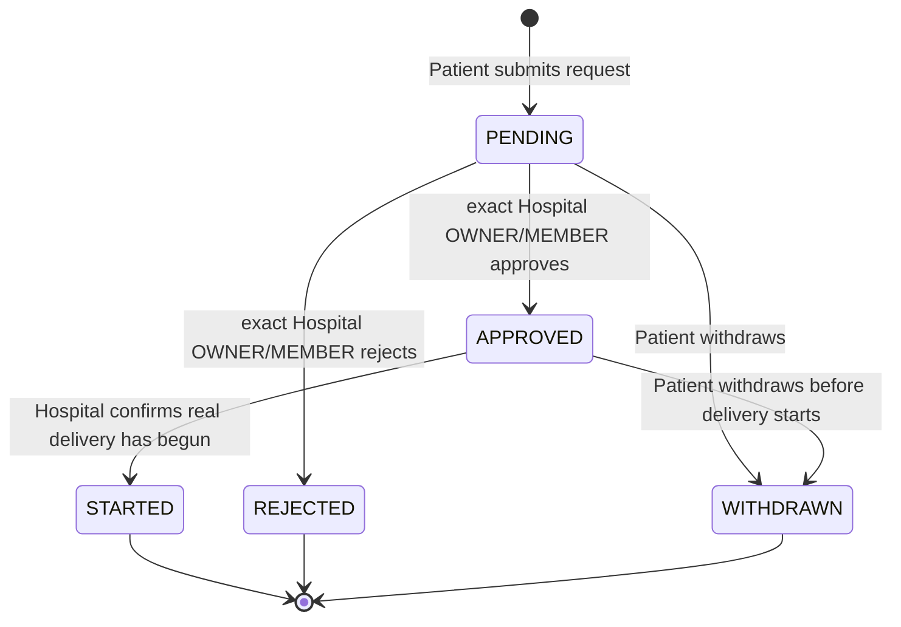

# Phase 17E.3 — Patient Core Flow Gap Closure

## Disposition

Phase 17E.3 implements the owner-approved current UAT contract for CARE-07 and
AUTH-04. It adds bounded Patient Service Request and Patient Access Request
domains while preserving the existing Patient provisioning, activation, care,
Program, and OSM assignment sources of truth.

The intended current-UAT journey is:

```text
Hospital provision OR Patient access request
→ Hospital verifies identity / establishes Patient relationship
→ existing one-time Patient activation
→ Patient sets own credential and logs in
→ Personal Home and existing Care Journey
→ Patient requests another Hospital service when applicable
→ Hospital reviews and starts the real operational workflow
```

This handoff does not implement Phase 17E.2 Consent or start Phase 17F.

## Owner-approved CARE-07 contract

“ขอเพิ่มบริการ” creates a `PatientServiceRequest`. It never creates a
`PatientProgram`, `PatientOsmAssignment`, `PatientHospitalRelationship`,
`ScreeningAssessment`, Goal Plan, Follow-up, or other clinical record.

The request categories are the bounded set `SCREENING` (คัดกรอง), `FOLLOW_UP`
(ติดตาม), and `EMPOWERMENT` (เสริมพลัง). They are request categories only. This
implementation does not map them to ScreeningAssessment, PatientFollowup,
Service 1, PAM/PROM, or Goal Plan semantics.

Each request is under the Patient’s existing exact
`PatientHospitalRelationship`. The browser relationship reference is a locator;
the server resolves the authenticated active User, persisted PATIENT role, same
Person, PatientProfile, exact relationship, and active Hospital. No Patient
Hospital relationship is created, moved, or inferred from Hospital hierarchy.

The exact Hospital’s requestable services are represented by
`HospitalServiceOffering`. It supports only the three fixed codes and one row
per Hospital/code. For this UAT slice, catalog configuration requires an active
HOSPITAL User with an active direct OWNER membership in the exact active
Hospital. This narrow authority is a UAT implementation default, not a general
future permission decision.

The Patient may select an OSM preference or choose “ให้โรงพยาบาลจัดผู้ดูแลให้”.
The service accepts a relationship locator, then revalidates the persisted
active OSM User role, active exact `OsmHospitalRelationship`, exact Hospital,
and active Hospital. Patient-facing projections show the OSM display name only.
The preference is stored separately from `PatientOsmAssignment`; it grants no
OSM access and cannot change an assignment. `PatientOsmAssignment` remains the
only assignment source of truth.

### CARE-07 lifecycle



`STARTED` does not create or imply any downstream clinical/operational record.
Hospital operators use the existing Program and assignment workflows
separately. No request-domain `COMPLETED` state is introduced.

The database partial unique index permits one unresolved request in `PENDING` or
`APPROVED` per exact relationship/offering. Once `STARTED`, the downstream
service/Program domain owns its operational lifecycle and a later request is
not automatically blocked.

## Owner-approved AUTH-04 contract

“ขอเปิดใช้งานสำหรับผู้ป่วย” is a public onboarding/access request, not public
account registration. The public form accepts a Thai National ID reference and
an active canonical Hospital. It does not accept password, role, HN, OSM,
Program, clinical data, caregiver, consent, or DOB credential data. Callback
phone is omitted.

The public Hospital projection contains only opaque Hospital ID, hospitalCode,
and Hospital name for canonical ACTIVE Hospitals. A requested Hospital is not
yet a PatientHospitalRelationship.

National ID is reference/lookup input and not identity proof. It is validated,
normalized, and hashed through `hashIdentityReference` in the existing
`thai-national-id` namespace. Only `identityKeyHash` is persisted. Raw National
ID is transient at submit/review and is excluded from database rows, browser
URLs, projections, audit metadata, and application error text. Public submission
returns the same Thai success response for first and repeated open requests and
does not reveal whether a Person, User, Patient relationship, or another open
request exists. Repeated open requests are protected by a partial unique index
on canonical identity hash plus Hospital.

### AUTH-04 lifecycle

```mermaid
stateDiagram-v2
  [*] --> PENDING: anonymous Patient submits reference request
  PENDING --> APPROVED: exact Hospital reviewer verifies identity directly
  PENDING --> REJECTED: exact Hospital reviewer rejects
  PENDING --> WITHDRAWN: Hospital records Patient's request to withdraw
  PENDING --> COMPLETED: identity verified; Patient account is already active
  APPROVED --> WITHDRAWN: Hospital records Patient's request before activation issuance
  APPROVED --> ACTIVATION_ISSUED: existing activation service issues/links activation
  ACTIVATION_ISSUED --> COMPLETED: linked first-time activation succeeds atomically
  APPROVED --> COMPLETED: current reconciliation finds an active Patient account
  REJECTED --> [*]
  WITHDRAWN --> [*]
  COMPLETED --> [*]
```



Public self-withdrawal is intentionally absent. A reviewer can record withdrawal
from `PENDING` or `APPROVED` when the requester asks the Hospital to cancel,
before activation is issued. A request ID combined with National ID is not
accepted as public authority.

Before approval, a direct Hospital OWNER or MEMBER must attest that identity was
checked directly with the requester and submit the National ID used in that
verification. The server hashes that transient value through the same canonical
pipeline and compares it with the stored request hash. A mismatch fails closed.
Knowing the number alone is not proof.

After verification, reconciliation uses the current Person/User/Patient domain
state and does not write provisioning records:

| Current state | Request result | Next action |
| --- | --- | --- |
| No Person, or Person/User/Patient relationship needs domain repair | `APPROVED` | Use existing controlled Patient provisioning, then return to the request |
| Same Person/User has valid PROVISIONED Patient role/profile/exact Hospital relationship | `APPROVED` | Use existing PatientActivation issuance through `patient:activation:issue` |
| Same Person/User has valid ACTIVE Patient account and exact Hospital relationship | `COMPLETED / ALREADY_ACTIVE` | Guide the Patient to Login or Phase 17E.1 assisted recovery; do not issue activation or mutate credentials |
| Activation is issued | `ACTIVATION_ISSUED` | Patient uses the existing one-time activation and chooses a credential |
| Linked activation completes successfully | `COMPLETED / ACTIVATION_COMPLETED` | Complete request in the same local transaction that activates the account and consumes activation |

`PatientAccessRequest` is evidence and request context, not a provisioning or
activation source of truth. The existing Patient provisioning workflow remains
responsible for Person/User/Profile/Hospital relationship creation. Existing
`PatientActivation` remains the only activation source of truth. Ambiguous
provider or local completion does not falsely complete the access request.

## Actor, action, and scope matrix

| Actor | Action | Scope and authority |
| --- | --- | --- |
| Anonymous visitor | Submit Patient access request | Bounded public application service; exact active canonical Hospital only; generic response |
| Active Patient User | Read own service requests, submit, withdraw | Persisted PATIENT role and own exact relationship re-resolved server-side |
| Active Hospital OWNER | Enable/disable service catalog | Exact active direct OWNER membership and exact active Hospital |
| Active Hospital OWNER or MEMBER | Review/approve/reject/start service request | Exact active direct membership and exact active Hospital |
| Active Hospital OWNER or MEMBER | Verify/review/reject/record requested withdrawal for access request | Exact active direct membership and exact requested active Hospital; approval requires identity-verification attestation |
| OSM | Patient-request review/catalog configuration | Denied; OSM preference does not grant reviewer authority |
| Platform ADMIN | Patient service/access operational review or catalog configuration | Denied; no Platform ADMIN bypass |
| Parent/child Hospital member | Act across Hospital hierarchy | Denied; direct exact Hospital scope only |

Every mutation checks actor, narrow capability, exact scope, and current
persisted state on the server. UI visibility, request IDs, relationship IDs,
offering IDs, and selected OSM relationship IDs are locators, not authority.

## Persistence and migration

The additive migration adds:

- `HospitalServiceOffering`, unique on Hospital plus fixed service code.
- `PatientServiceRequest`, with composite foreign keys tying its relationship
  and offering to the same Hospital.
- `PatientAccessRequest`, storing canonical identity hash, workflow state,
  bounded review attribution, and optional resolved domain references.
- Optional unique linkage from one existing `PatientActivation` to one access
  request.
- Partial unique indexes for unresolved Patient service requests and unresolved
  access requests. Comments in migration SQL explain these constraints because
  Prisma schema cannot represent them.

The migration is additive and has no destructive changes, data backfill, Patient
identity mutation, Program conversion, OSM assignment conversion, or Consent
change.

## Audit and privacy boundary

Privileged decisions record bounded Hospital/request/offering IDs, status,
resolution, action, and timestamp using the existing audit service. Patient
self-create/withdraw uses domain timestamps and actor references without noisy
generic audit events. National ID, identity hash, callback phone, Patient/OSM
names, credentials, activation tokens, and clinical content are not audit
metadata.

Patient-facing service history contains Hospital/service/status/date and the
preferred OSM display name, explicitly labelled as a preference. It does not
show OSM phone, National ID, User/auth-provider IDs, or unrelated membership
data. Work views are limited to direct exact Hospital scope.

## UAT flows

### Controlled Patient onboarding

`/login` → “ขอเปิดใช้งานสำหรับผู้ป่วย” → National ID reference and active
Hospital → generic acknowledgement → Hospital Work access-request review →
direct identity check and attestation → existing provisioning workflow if
required → existing PatientActivation issue → Patient chooses credential →
normal Login.

If the account is already active, no User, activation, or credential is created
or changed. The Hospital directs the Patient to Login or the assisted recovery
flow.

### Patient requests an additional service

Personal → `บริการของฉัน` → own exact Hospital → enabled request offering →
optional preferred OSM or Hospital-managed care preference → `PENDING` → exact
Hospital OWNER/MEMBER review → `APPROVED` or `REJECTED` → Hospital uses the
existing operational Program/assignment workflow → marks `STARTED` when real
delivery begins. The Patient may withdraw before `STARTED`.

## Verification evidence

Focused unit coverage includes narrow policies, schemas, Thai status/category
presentation, Login entry separation, public generic response, and Thai-first
Patient/Hospital UI projections. PostgreSQL integration coverage uses real
database transactions for public submission/repeat handling, assisted identity
verification, exact Hospital authorization, existing Patient reconciliation,
controlled provisioning handoff, activation linkage/completion/ambiguity,
catalog isolation, Patient SELF request and history, exact OSM preference,
assignment/Program non-mutation, lifecycle transitions, partial unique
constraints, and concurrent mutation races.

Verification completed:

- `npx prisma validate` — passed.
- `npm run prisma:generate` — passed; Prisma Client v6.19.3.
- `npm run prisma:migrate:test` — passed; the additive migration applied to the
  local PostgreSQL integration database.
- Focused Patient core tests — 9 files / 55 tests passed.
- `npm run test:integration` — 25 files / 233 tests passed against local
  PostgreSQL; no migrations were pending.
- `npm run test` — 165 files / 1,176 tests passed.
- `npm run typecheck` — passed.
- `npm run lint` — passed with no warnings or errors.
- `git diff --check` — passed on the final diff.
- Browser review at 390px covered `/login` and `/patient/access-request`;
  neither page had horizontal overflow. Authenticated Personal and Work
  routes were not browser-captured because no browser test account was
  available. A focused presentation test covers the public access-request form,
  Patient services workspace, Hospital service catalog, and access-review
  controls. PostgreSQL/domain tests cover the service-request review workflows
  and their authorization boundaries.
- Impeccable finish review — `ship` for the captured public access-request
  surface; authenticated Personal and Work routes received source review only,
  with no browser visual verdict. The design-system handoff found no durable
  visual-system change to record, so `DESIGN.md` and its sidecar remain intact.

## Re-audit and current-UAT closure

**PATIENT CORE BUSINESS JOURNEY — CLOSED FOR THE CURRENT UAT CONTRACT.**

The re-audit found a supported route through each core checkpoint:

1. Hospital-side Patient provisioning remains in the existing
   `/app/patients/provision` workflow; controlled onboarding requests enter at
   `/patient/access-request` and never create a Person or User.
2. First-time credential setup continues through the existing
   `PatientActivation` flow. A linked access request completes only after that
   activation succeeds, or after verified reconciliation proves the account is
   already active.
3. Login and Personal Home remain the existing `/login` and `/app/personal`
   entry points. Existing profile, My Health, and Care Journey routes remain
   server-scoped to the Patient's own Person and exact Hospital relationship.
4. The new `/app/personal/services` route closes the gap for requests to
   additional Hospital offerings without turning a request into a Program or
   assignment.
5. Existing Patient appointment interactions remain in
   `/app/personal/appointments`; password change and assisted recovery remain
   in the Phase 17E.1 account-security flow.

This closure is limited to the supported core journey. It does not close the
separate feature and semantic gates below.

## Remaining Patient extensions and gates

This phase closes the current core Patient business journey only. It does not
implement:

- CARE-02 PAM/PROM instruments, exact semantics, scoring, or mapping.
- CARE-06 Patient-authored clinical measurements.
- PAT-03 age/BMI/NCD diagnosis/family history.
- PAT-05 Health Plan semantics.
- ACCOUNT-02 consent; Phase 17E.2 remains parked/requirement-gated.
- Family/Caregiver, medication, wellness, notifications, or Hospital content/contact redesign.

Long-term activation proofing/channel decisions beyond the approved assisted
verification UAT contract remain governed by the existing product/ADR gates.
The existing shared/deployment-level abuse-protection and rate-limiting gate
must be closed before exposing the public request to general public traffic;
the database duplicate invariant is not a substitute for rate limiting.
Patient core closure does not imply all Patient features are complete.
