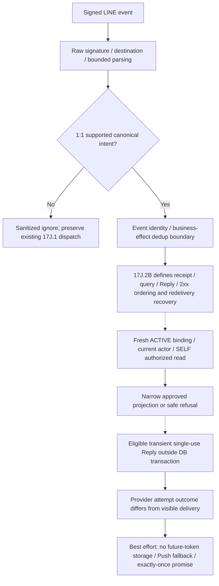

# Phase 17J.2A — Reactive Messaging Decision Pack / First Command Boundary

- วันที่ตรวจ: 2026-10-07; source baseline: `adebb1a`; working tree สะอาดก่อนเริ่ม
- Bounded correction ตรวจจาก HEAD `fea64241087f5756f59d3549bd55e683777cbb81` และ current official LINE documentation; ปรับเฉพาะ recommendations/lifecycle separation โดยไม่เปลี่ยน runtime
- **17J.2A — CLOSED / OWNER DECISION COMPLETE**
- **17J.2B — NOT STARTED**; **17J.2 runtime — NOT IMPLEMENTED**

## CURRENT OWNER CLOSEOUT — 2026-10-07

Owner อนุมัติ bounded first slice โดยคำสั่ง “Phase 17J.2A — Owner Decision Closeout” จาก reviewed HEAD `2969f55b91799627d8b05a146801438f65d219c3`. Final authority: [owner closeout](./PHASE_17J2A_REACTIVE_MESSAGING_DECISION_CLOSEOUT.md). **Q01–Q07/Q10/Q12–Q14 — CLOSED / OWNER APPROVED — 2026-10-07**; Q08/Q09/Q11 already CLOSED under existing architecture, ไม่ newly decided. Q10 product expectation CLOSED แต่ recovery/scheduling mechanics **OPEN / 17J.2B TECHNICAL DESIGN REQUIRED**

Approved: PATIENT SELF, READ ONLY, deterministic Rich Menu business postback, 1:1, stateless, current ACTIVE binding/current DEMI SELF authorization, nearest future canonical SCHEDULED across all currently authorized own relationships; **Thai date/time + Hospital display name only**, no status label/embedded appointment link; unsupported events sanitized-ignore; best-effort Reply/no Push fallback. Owner รับทราบ healthcare timing/Hospital relationship exposure ใน LINE ตาม closeout §5; proactive disclosure/P17D-NOTIF-01 ไม่ถูกอนุมัติ

ข้อความ **RECOMMENDATION — NOT OWNER APPROVED**, candidate alternatives และ pre-closeout analysis ด้านล่างคงไว้เป็น **historical decision evidence ณ เวลาเขียน pack**, ไม่ใช่ current owner status. เฉพาะ choices ที่ตรง closeout ได้รับ approval; alternatives ไม่ได้รับ approval. Current table statuses, completed checklist และ §16 ใช้สถานะใหม่; technical recommendation/query seam ยังต้องเขียน 17J.2B ไม่ถือ algorithm approval

## 1. Current status

| Phase | สถานะปัจจุบันและ authority |
| --- | --- |
| 17J.0 | CLOSED / ARCHITECTURE CONTRACT COMPLETE — [architecture contract](./PHASE_17J0_LINE_OA_LIFF_ARCHITECTURE_IDENTITY_CONTRACT.md), [ADR-0009](../adr/0009-demi-line-oa-liff-identity-and-messaging.md) |
| 17J.0B | CLOSED / OWNER DECISION CLOSED — Option C, [owner closeout §1–4](./PHASE_17J0B_MULTI_ROLE_RICH_MENU_DECISION_CLOSEOUT.md) |
| 17J.1 | IMPLEMENTED / AUTOMATED VERIFICATION COMPLETE — [current CONTEXT addendum](../CONTEXT.md), [implementation handoff](./PHASE_17J1_LINE_ACCOUNT_LINK_RICH_MENU_IMPLEMENTATION.md); verified against source below |
| 17J.2A | CLOSED / OWNER DECISION COMPLETE — [owner closeout](./PHASE_17J2A_REACTIVE_MESSAGING_DECISION_CLOSEOUT.md), 2026-10-07; documentation only |
| 17J.2B / 17J.2 runtime | NOT STARTED / NOT IMPLEMENTED |

External LINE provisioning, real LINE/mobile/device UAT และ production deployment ยังคง NOT CLAIMED / NOT EXECUTED ตาม handoff 17J.1. ไม่อนุมาน live readiness จาก automated evidence และไม่ได้รันทดสอบ runtime ใหม่ในงานนี้

## 2. Purpose and exact boundary

ปิดคำถาม product/privacy/interaction ที่ต้องทราบก่อนเขียน **Phase 17J.2B — Deterministic Reactive Messaging Technical Contract**. Pack เก็บประวัติข้อเสนอคำสั่งอ่านนัดหมายของตนหนึ่งคำสั่ง; disclosure approval ปัจจุบันมาจาก owner closeout ไม่ใช่ pack อนุมัติเอง ไม่เขียน technical contract และไม่ implement runtime/schema/provider resource

เส้นทางที่สถาปัตยกรรมรับรอง: LINE webhook → verified ACTIVE binding → current DEMI User/Person/actor → current server policy → existing business query → privacy-approved projection → immediate Reply. LINE เป็น transport/presentation; Appointment และ Patient SELF เป็นเจ้าของข้อมูลและกฎ ไม่สร้าง appointment domain ที่สองใน LINE

## 3. Repository/source audit and evidence register

อ่านเอกสารที่ระบุด้านล่างและตรวจ implementation/policy/schema/routes/tests ที่เกี่ยวข้อง ใช้ current source เป็นหลักฐานพฤติกรรม ไม่ใช้ legacy repository. Test source แสดง assertions ที่มีอยู่ **ไม่ใช่ผลการรันทดสอบใน 17J.2A**

| Evidence | Source ที่ตรวจและข้อเท็จจริง |
| --- | --- |
| E01 | [CONTEXT](../CONTEXT.md), [ADR-0009 Decision 1–8](../adr/0009-demi-line-oa-liff-identity-and-messaging.md), [17J.0 §11, §15–19](./PHASE_17J0_LINE_OA_LIFF_ARCHITECTURE_IDENTITY_CONTRACT.md): dedicated Provider/identity; current authorization; deterministic/stateless interaction; reactive appointment fields OPEN ณ original architecture closeout; first-slice D-NARROW ปิดโดย current owner closeout |
| E02 | [17J.0B §1–4](./PHASE_17J0B_MULTI_ROLE_RICH_MENU_DECISION_CLOSEOUT.md), [17J.1 contract J1-07/J1-15/J1-17](./PHASE_17J1_LINE_ACCOUNT_LINK_RICH_MENU_IMPLEMENTATION_CONTRACT.md), [17J.1 handoff Reachability, webhook, and Option C / Runtime review corrections](./PHASE_17J1_LINE_ACCOUNT_LINK_RICH_MENU_IMPLEMENTATION.md): menu preference ไม่ใช่ authority; durable acceptance และ deferred reconciliation |
| E03 | [webhook route](../../app/api/line/webhook/route.ts), [webhook service](../../src/modules/line/services/line-webhook-service.ts), [schemas](../../src/modules/line/schemas/line-schemas.ts), [signature adapter](../../src/modules/line/adapters/line-webhook-security.ts): raw-byte verification/destination validation; supported events แคบ; per-event receipt/effect transaction |
| E04 | [Messaging client](../../src/modules/line/adapters/line-messaging-client.ts), [scheduler](../../src/modules/line/transport/line-reconciliation-scheduler.ts), [reconciler](../../src/modules/line/services/line-menu-reconciler.ts), [catalog](../../src/modules/line/rich-menu/catalog.ts), [deep-link builder](../../src/modules/line/services/line-deep-link-builder.ts): Rich Menu only; no Reply/Push; existing URLs เป็น account LIFF root หรือ authorized web workspace |
| E05 | [account service](../../src/modules/line/services/line-account-service.ts), [reachability service](../../src/modules/line/services/line-reachability-service.ts), [eligibility service](../../src/modules/line/services/line-eligibility-service.ts), [schema](../../prisma/schema.prisma), [LINE migration](../../prisma/migrations/20261006120000_line_account_linking_rich_menu/migration.sql): ACTIVE = `unlinkedAt IS NULL`; ACTIVE uniqueness/conflict guard; cleanup locator ไม่ใช่ binding authority |
| E06 | [17D.0 Owner-approved contract / §20 Decision-to-contract mapping](./PHASE_17D0_APPOINTMENT_INTERACTION_CONTRACT_CONSOLIDATION.md), [17D.1 implementation](./PHASE_17D1_APPOINTMENT_INTERACTION_IMPLEMENTATION.md), [appointment service](../../src/modules/appointments/services/appointment-service.ts), [appointment policy](../../src/modules/appointments/policies/appointment-policy.ts), [definitions](../../src/modules/appointments/domain/appointment-definitions.ts): acknowledgement/request/canonical status แยกกัน; no Patient direct cancellation/reschedule |
| E07 | [Patient SELF policy](../../src/modules/patient-self/policies/patient-self-policy.ts), [SELF query](../../src/modules/patient-self/services/patient-self-query-service.ts), [care query](../../src/modules/patient-self/services/patient-self-care-query-service.ts): persisted User ACTIVE/PATIENT/exact Person/own relationship; current appointment history DTO กว้างกว่าข้อมูลที่ควรส่ง LINE |
| E08 | [appointment root](../../app/app/personal/appointments/page.tsx), [relationship list](../../app/app/personal/appointments/[relationshipId]/page.tsx), [detail](../../app/app/personal/appointments/[relationshipId]/[appointmentId]/page.tsx), [page context](../../src/modules/patient-self/transport/patient-self-care-page-context.ts), [date presentation](../../app/app/personal/patient-self-care-presentation.tsx): authenticated server reads; root เป็น Hospital chooser; Thai datetime display Asia/Bangkok |
| E09 | [SELF query tests](../../src/modules/patient-self/services/patient-self-query-service.test.ts), [SELF care tests](../../src/modules/patient-self/services/patient-self-care-query-service.test.ts), [SELF policy tests](../../src/modules/patient-self/policies/patient-self-policy.test.ts), [appointment service tests](../../src/modules/appointments/services/appointment-service.test.ts), [PostgreSQL appointment tests](../../tests/integration/appointments.integration.test.ts): ownership denial, history paging/projection, independent acknowledgement, atomic request review |
| E10 | [webhook tests](../../src/modules/line/services/line-webhook-service.test.ts), [route tests](../../app/api/line/webhook/route.test.ts), [deep-link tests](../../src/modules/line/services/line-deep-link-builder.test.ts): malformed/unsupported siblings, duplicate no-op, revoked workspace denial, response/scheduling boundary และ allowlisted navigation |

### Evidence conflicts / gaps

1. ADR-0009 owner addendum, 17J.0 CURRENT addendum และ 17J.0B §7 ยังกล่าวว่า 17J.1 runtime NOT IMPLEMENTED ในเอกสารที่เขียนก่อน implementation. เป็น **documentation chronology/status conflict** กับ current CONTEXT, 17J.1 handoff และ source ที่มี runtime จริง ใช้หลักฐานใหม่เป็นสถานะปัจจุบัน; ไม่เปิด architecture หรือ Option C ใหม่ และไม่แก้เอกสารเก่าข้าม scope งานนี้
2. Immediate Reply กับ deferred provider work มี lifecycle tension (รายละเอียด §11) ไม่ใช่ข้อพิสูจน์ว่า 17J.1 ผิด เพราะ reconciliation มี durable repair แต่ Reply ไม่มี token ที่เก็บไว้ส่งภายหลังได้
3. ยังไม่มี exact upcoming SELF query, business postback action, receipt enum สำหรับ reactive command หรือ Reply method. เป็น **implementation gaps ตาม phase boundary** ไม่ใช่ข้ออนุมัติให้ implement ใน 17J.2A. Builder ไม่มี appointment navigation intent แต่ corrected first-slice recommendation ไม่ใช้ embedded appointment link; detailed/list navigation เลื่อนไป 17J.3

## 4. Current LINE runtime evidence

`POST /api/line/webhook` เรียก `processLineWebhookRequest`; อ่าน body สูงสุด local 1 MiB, verify signature ก่อน decode/parse และตรวจ configured bot destination. Supported events คือ user-sourced follow/unfollow และ postback marker `DEMI_LINE_WORKSPACE_SWITCH_V1` เท่านั้น. Message text/generic postback/group/room ไม่ได้เป็น business command; unsupported events ไม่มี receipt

`persistProviderEvent` สร้าง unique `LineWebhookEventReceipt` และ reachability/preference effect ใน serializable transaction ต่อ event. P2002 ที่ตรวจพบ receipt เดิมให้ DUPLICATE/no-op. Receipt มี event ID/type/occurredAt/acceptedAt/outcome เท่านั้น; enum ปัจจุบันมี FOLLOW, UNFOLLOW, RICHMENUSWITCH และ outcomes APPLIED, STALE, IGNORED. ไม่มี token, payload, reply outcome หรือ delivery intent. `replyToken` เป็น optional schema field แต่ไม่ได้ถูกใช้หรือ persist; `isRedelivery` ไม่ใช่ authority/dedup key

Route คืน 200 หลัง durable processing พร้อม counters และ register `after()` สำหรับ binding reconciliation; ไม่ await Messaging API. DB acceptance failure ให้ 503; invalid signature/destination ให้ 401. Provider failure ภายหลังไม่ rollback receipt/authority และ menu มี lazy/operator repair

Workspace preference ต้องมี known alias, SUCCESS, exact current eligible-set menu และ current ACTIVE User; timestamp เก่าถูก ignore, equal-time conflict clear preference. Catalog มี URI และ native richmenuswitch actions ไม่มี “ตรวจสอบนัดหมาย”. Messaging client มีเฉพาะ Rich Menu operations ไม่มี Reply/Push method

Binding resolution ใช้ verified subject เป็น locator ไป ACTIVE binding เท่านั้น ไม่ใช้ unlinked cleanup locator, retained fingerprint หรือ reachability เป็น Patient authority. Follow/unfollow ไม่ link/unlink User. Current eligible-role projection อาจใช้ SELF context เพื่อแสดง PATIENT menu แต่ command ต้องตรวจ SELF policy/persistence ใหม่ ไม่ trust projection หรือ preference

## 5. Current Appointment / Patient SELF evidence

Canonical `PatientAppointment` ผูก `PatientHospitalRelationship`, `scheduledAt` เป็น `DateTime @db.Timestamptz(3)`, status มี SCHEDULED, COMPLETED, CANCELLED, NO_SHOW. ไม่มี stored appointment timezone/calendar-day หรือ upcoming status. `updatedAt` เป็น version ของ interactions; acknowledgement ไม่เปลี่ยน status. Cancellation request PENDING/REJECTED/SUPERSEDED ไม่ยกเลิกนัด; approval ทำ canonical cancellation และ request disposition atomically ตาม 17D.1

`assertPatientSelfReadPolicy` ตรวจ PATIENT และ actor identifiers/capability; **policy อย่างเดียวไม่พิสูจน์ ownership/current account**. `ownPatientWhere` จึงตรวจ exact Person ↔ User ACTIVE และ persisted PATIENT role; `resolveOwnPatientRelationshipContext` ตรวจ relationship ของ PatientProfile คนเดิม. ไม่รับ relationship จาก postback. SELF context/relationship navigation อ่าน own Hospitals ได้ทุก operational status รวม SUSPENDED/PENDING_VERIFICATION; test “resolves all own Hospital relationships independently of Hospital operational status” ยืนยัน. ไม่มี ACTIVE relationship flag ที่จะนำมาเดาเพิ่มใน SELF read นี้

`getOwnPatientAppointmentHistory` จำกัดหนึ่ง relationship, ทุก status/เวลา, `scheduledAt desc, id desc`, page 50 + lookahead 1. จึงเอาแค่รายการแรกหรือกรองแค่หน้าแรกมาใช้เป็น next appointment ไม่ได้. Detail ตรวจทั้ง appointment และ authorized relationship. `PatientSelfAppointmentItem` รวม IDs, locationDetail, responsibleDisplayName/profession, osmAtCreationDisplayName, acknowledgement และ cancellationRequests; **ห้ามส่ง DTO ทั้งก้อนให้ LINE**. Hospital name อยู่ใน relationship context ไม่ใช่ item โดยตรง

**RECOMMENDATION — NOT OWNER APPROVED:** 17J.2B กำหนด narrow application query/projection ในเจ้าของ Patient SELF/Appointment โดย reuse ownership/policy/status source; LINE รับเฉพาะ approved result/explicit mapper. Domain เลือก nearest จาก persisted SELF scope โดยไม่ scrape web page, filter history page แรก, loop fetch ทุก history หรือทำ rules/DB access ซ้ำใน LINE. Internal stable tie-break locator ใช้ได้เฉพาะ server ไม่ serialize/log

## 6. Candidate reactive-intent inventory

| Candidate | Source / disposition |
| --- | --- |
| ตรวจสอบนัดหมาย — PATIENT SELF upcoming summary | E06–E09: existing authoritative read; **RECOMMENDATION — NOT OWNER APPROVED** สำหรับ first slice |
| Unsupported text/generic postback/media | E03/E04: **RECOMMENDATION — NOT OWNER APPROVED** sanitized ignore ตาม Q13; ไม่เพิ่ม help reply/text command ใน first slice |
| Account link/manage และ workspace switch | มีจริงใน 17J.1 (E02–E05); preserve ไม่เรียกว่า conversational business command ใหม่ |
| PATIENT acknowledgement/cancellation request | มี web semantics (E06) แต่ **excluded from first reactive tranche**; การมี API/domain ไม่ใช่ chat approval |
| OSM/HOSPITAL roster หรือ appointment commands | Work authority มีจริง แต่ไม่มี approved chat projection/scope interaction; deferred ไม่ invent capabilities |
| Family, medication, clinical, reminders, free-form chatbot | ไม่มี first-slice approval; out of scope และ gates เดิมคงอยู่ |

## 7. Recommended first tranche (historical; approved choice in current closeout)

**RECOMMENDATION — NOT OWNER APPROVED:** READ ONLY — PATIENT SELF “ตรวจสอบนัดหมาย”, deterministic Rich Menu business postback อย่างเดียว, 1:1 source, zero conversation state. Resolve ACTIVE binding และ fresh current DEMI actor/PATIENT SELF authorization ทุก command; เลือกนัด canonical SCHEDULED ที่ใกล้ที่สุดหนึ่งรายการจากทุก own relationship ที่ policy เดิมอนุญาต ณ เวลา query. Q03 แนะนำ **D-NARROW: Thai date/time จาก scheduledAt + Hospital display name เท่านั้น**; ไม่มี status label/ข้อมูลอื่นหรือ embedded appointment-list/detail link. Arbitrary text/unsupported events sanitized-ignore; Reply best effort, no mutation/no Push fallback

ข้อความตัวอย่าง **RECOMMENDATION — NOT OWNER APPROVED** สำหรับ owner review เท่านั้น:

```text
นัดหมายถัดไปของคุณ
วันที่ 15 ตุลาคม 2569 เวลา 09:00 น.
โรงพยาบาล ...
```

Authorized successful empty result: “ไม่พบนัดหมายที่กำลังจะมาถึง”. วันเวลาแสดงตามกฎเวลาไทยใน Q04; ไม่มี status/attendance confirmation/acknowledgement หรือ CTA. ไม่ใช้ type/notes เพื่อแต่งข้อความ และไม่สร้างคำสั่ง/marker/assets จริงในงานนี้

## 8. J2-Q01..J2-Q14 decision table

Alternatives/recommendations/evidence คงเดิมเป็น historical analysis; **Exact status** ระบุ final authority จาก [owner closeout](./PHASE_17J2A_REACTIVE_MESSAGING_DECISION_CLOSEOUT.md). Newly approved choices: Q01 A, Q02 A, Q03 D-NARROW, Q04 A, Q05 A, Q06 C, Q07 A, Q10 A, Q12 A, Q13 A, Q14 A. Q08/Q09/Q11 already closed ไม่ใช่มติใหม่; Q10 mechanics ยัง OPEN / 17J.2B

| ID / owner question | Evidence / options | Recommendation และเหตุผล | Privacy/security impact / implementation consequence | Exact status |
| --- | --- | --- | --- | --- |
| J2-Q01 เริ่ม domain ใด? | E01/E06/E07: A SELF appointment only; B PATIENT+OSM/HOSPITAL; C generic multi-domain; D owner-defined | **A** มี read path จริงและคุณค่าผู้ใช้โดยไม่เปิดหลาย Patient | ลด operator-data disclosure; หนึ่ง business intent เท่านั้น | **CLOSED / OWNER APPROVED — 2026-10-07** |
| J2-Q02 เรียกคำสั่งอย่างไร? | E03/E04: A Rich Menu/postback only; B postback+tiny exact-text allowlist; C free-form/NLU; D other | **A** เป็น business-command entry เดียวของ first slice; text alias เช่น “ตรวจสอบนัดหมาย” ต้องเป็น separately approved future extension | Static versioned intent marker only ไม่มี role/resource/PII. No text parser/aliases/help reply ใน first slice; C ขัด no-NLU boundary. 17J.2B กำหนด exact postback parser/marker ต่างจาก workspace switch | **CLOSED / OWNER APPROVED — 2026-10-07** |
| J2-Q03 ส่ง appointment fields ใดใน LINE? | E01 §18/E07: A existence/status-only; B previous minimal date/time/Hospital/high-level status; C เพิ่ม type/duration/locationType; D explicit owner-defined projection | **D-NARROW:** scheduledAt rendered as approved Thai date/time + Hospital display name เท่านั้น ช่วยจำวันไปโรงพยาบาล; ตัด status label ที่ซ้ำกับ SCHEDULED selection และอาจสับสนกับ acknowledgement | ยังเผย care association/เวลาใน chat/preview/screenshots/shared device; owner/privacy ต้องอนุมัติ exact fields. No type/duration/location/staff/OSM/acknowledgement/requests/IDs/HN/name/clinical data; no approval = no detail disclosure | **CLOSED / OWNER APPROVED — 2026-10-07** |
| J2-Q04 “upcoming” หมายถึงอะไร/ข้าม Hospital หรือไม่? | E06–E09: A nearest future SCHEDULED ทุก own relationships; B today/day window; C bounded list/window; D owner-defined | **A:** `status=SCHEDULED`, `scheduledAt >= server query now` inclusive, ascending scheduledAt then id, take 1 across all own eligible relationships; no arbitrary 90-day cap | Exclude CANCELLED/COMPLETED/NO_SHOW. Pending/rejected/superseded request และ acknowledgement ไม่เปลี่ยน eligibility. Bangkok display only; no role/Hospital precedence. Narrow source query ต้องกำหนด exact selection (§5) | **CLOSED / OWNER APPROVED — 2026-10-07** |
| J2-Q05 ถ้าไม่มีนัดที่เข้าเกณฑ์ตอบอย่างไร? | E07 history ≠ upcoming: A “ไม่พบนัดหมายที่กำลังจะมาถึง”; B same + navigation; C other | **A:** “ไม่พบนัดหมายที่กำลังจะมาถึง” ไม่มี CTA/link ใน first tranche สอดคล้อง Q06-C | ใช้เฉพาะ authorized successful empty result; ไม่แปล missing authority/DB failure เป็น empty; ไม่สื่อไม่มีประวัติ/ลบข้อมูล | **CLOSED / OWNER APPROVED — 2026-10-07** |
| J2-Q06 ออกจาก chat ไปดูรายละเอียดอย่างไร? | E04/E08: A inside chat only; B bounded details/list link ไป `/app/personal/appointments`; C defer embedded navigation to 17J.3; D other | **C:** first reply อยู่ใน LINE chat; narrow summary มีประโยชน์โดยไม่บังคับ web flow. Detailed/list navigation รอ authenticated LIFF lifecycle/auth/session contract 17J.3 | LINE binding ≠ active DEMI/Supabase browser session; B อาจผ่าน login ก่อนดูหน้า เป็น UX tradeoff ไม่ใช่ unsafe route. Existing authorized web route คงเดิม; first slice ไม่เพิ่ม appointment-link intent หรือ LIFF session UX | **CLOSED / OWNER APPROVED — 2026-10-07** |
| J2-Q07 unlinked/ineligible/suspended/stale/conflict/group? | E01/E03/E05/E07: A generic private refusal + account navigation; B silent all; C other safe copy | **A** สำหรับ recognized 1:1 intent; group/room silent ignore; รายละเอียด §10 | Generic denial ไม่บอก account/Patient/resource ของคนอื่น; recheck authority ก่อน query. Missing token = no reply/no fallback | **CLOSED / OWNER APPROVED — 2026-10-07** |
| J2-Q08 multi-role ทำคำสั่ง PATIENT ได้เมื่ออยู่ workspace อื่นหรือไม่? | E02 §3/E06/E07: A current SELF authority independent of selected menu; B menu-dependent; C other | **A** เมื่อ exact command ถูกส่งและ SELF ปัจจุบัน valid แม้ selected OSM/HOSPITAL; ไม่ switch role หรือ precedence | Client role claims ignored; stale/copied postback expands zero authority; B ใช้เป็น authorization ไม่ได้ | **CLOSED / EXISTING OWNER-APPROVED AUTHORITY BOUNDARY — E02/E06**; NOT NEWLY DECIDED; ไม่เปิด Option C ใหม่ |
| J2-Q09 Reply lifecycle ต้องรักษาอะไร? | ADR-0009 Decision 5, E01/E02/E04; official reference §11 | ใช้ event replyToken as soon as possible, single-use/transient; no X-Line-Retry-Key for Reply, no Push fallback, no exactly-once claim, domain truth แยก provider outcome | ไม่ persist เป็น future-delivery credential หรือใช้ token ที่ใช้แล้ว; unused eligible token ใน redelivery ไม่ถูกห้ามด้วย event dedup อย่างเดียว. Scheduling/recovery อยู่ 17J.2B ไม่ assume scheduler suitability | **CLOSED / EXISTING ARCHITECTURE BOUNDARY — NOT NEWLY DECIDED**; scheduling/recovery mechanics **OPEN / 17J.2B TECHNICAL DESIGN REQUIRED** |
| J2-Q10 ยอมรับ best-effort reactive UX หรือไม่? | E01 §13/E03/E05/E10 และ official LINE §11: A best effort ผู้ใช้อาจไม่ได้รับ reply และกดใหม่ได้; B owner-defined product expectation ภายใน invariants | **A** ไม่สัญญาว่าทุก accepted webhook มีหนึ่ง visible reply; provider/network/crash failure อาจไม่มีข้อความตอบ ผู้ใช้เริ่ม read-only command ใหม่ได้อย่างปลอดภัย | แยก business effect dedup, authorized query, Reply attempt และ visible delivery. Owner ไม่เลือก transport/database algorithm; redelivery-assisted read/Reply, ambiguous outcome, receipt/query/Reply/2xx ordering และ concurrency เป็น 17J.2B | **CLOSED / OWNER APPROVED — 2026-10-07** (product expectation only); **OPEN / 17J.2B TECHNICAL DESIGN REQUIRED** (recovery mechanics) |
| J2-Q11 ต้องมี conversation state หรือไม่? | E01 initial stateless UX; A zero state; B multi-message session; C other | **A:** tap → lookup → reply → done | ไม่มี pending question/session/wizard/chat OTP/HN/National-ID lookup. Existing account action intents/menu preference/event receipts ไม่ใช่ conversation state | **CLOSED / EXISTING INITIAL STATELESS BOUNDARY — E01**; NOT NEWLY DECIDED; future multi-message requires separate contract |
| J2-Q12 log/audit อะไรบ้าง? | E01 privacy/E03 receipt/E05 link audit/E07 read path: A sanitized telemetry without clinical read audit; B durable every-read audit; C other approved policy | **A** correlation ID, permitted event ID, canonical intent, outcome/category, duration เท่านั้น | No raw text/postback/subject/tokens/PII/appointment/resource IDs/clinical data. Event ID access/retention ตาม existing policy; pack ไม่ขยาย retention. No evidence ordinary successful SELF read requires AuditEvent; lifecycle audits unchanged | **CLOSED / OWNER APPROVED — 2026-10-07** |
| J2-Q13 unsupported events/messages ทำอย่างไร? | E01/E03/E04: A sanitized ignore; B owner-defined deterministic alternative requiring explicit scope review | **A:** arbitrary text, unknown/generic postback, image/audio/video/file/location/sticker และ group/room Patient events sanitized-ignore; no text help reply | Exact known business postback เท่านั้นเข้า reactive command; workspace-switch ใช้ 17J.1 unchanged. No message/text command, text parser/alias/fuzzy/NLU/LLM/chatbot/help state; future exact text alias ต้อง separately approved extension | **CLOSED / OWNER APPROVED — 2026-10-07** |
| J2-Q14 first slice มี mutation หรือไม่? | E06 web interactions approved ≠ chat approval: A READ ONLY; B add acknowledgement/request etc.; C other | **A** scope เล็ก ทดสอบ authority/disclosure/transport ก่อน | No acknowledge/cancel request/reschedule/create/complete/no-show/coordination; no new domain side effects/read clinical audit automatically. B ต้องมี separate action contract ไม่ inherit web permission เป็น chat UX | **CLOSED / OWNER APPROVED — 2026-10-07** |

### Q04 precision and non-inherited rules

Server query ใช้หนึ่ง captured current instant; ไม่ใช้ webhook timestamp เป็น business cutoff และไม่ใช้ “ตั้งแต่เที่ยงคืนวันนี้”. Appointment ตรง boundary ถูก include; นัดที่เริ่มก่อน now แม้ duration ยังไม่จบถูก exclude. Equal scheduledAt เลือก internal id ascending อย่าง deterministic โดยไม่ส่ง ID ไป LINE. ไม่มี count/รายการ Hospital อื่นใน reply; รายการทั้งหมดอยู่ใน existing authorized web UI โดย first-slice Reply ไม่ embed link

Scope ตาม SELF เดิมรวม own relationships โดยไม่เพิ่ม Hospital ACTIVE filter หรือ Family 90-day SCHEDULED/CANCELLED grant window. Current owner closeout อนุมัติ Q04-A ตาม precision นี้; alternative ต้องได้รับ approval ใหม่. Missing PatientProfile/ไม่มี own relationship = ineligible response Q07; own relationship มีแต่ไม่มี matching appointment = empty Q05. การอ่าน own relationship ของ suspended Hospital ยังคงได้ตาม policy ที่ตรวจ ไม่สร้าง operational Hospital authority

Asia/Bangkok เป็น **display-time choice** ตาม `formatPatientDateTime`, locale `th-TH`, dateStyle medium/timeStyle short (Thai calendar ตาม formatter), ใช้คำว่า “เวลาไทย”. Stored scheduledAt เป็น absolute instant; ไม่อ้างว่า schema เก็บ Bangkok business timezone หรือ reminder scheduling rule. LINE ไม่ import UI formatter จาก higher layer; 17J.2B ระบุ domain-safe presentation reuse โดยไม่เปลี่ยน source instant

## 9. Privacy/disclosure matrix

**Historical alternative matrix:** current owner อนุมัติเฉพาะ D-NARROW date/time + Hospital display name และ summary/empty copy ตาม closeout; A/B/C เป็น alternatives ที่ไม่ได้เลือก. Candidate labels ใน matrix เป็น pre-closeout analysis. Authenticated web allowlist หรือ Family grant disclosure ไม่ใช่ LINE approval. Rich Menu/postback มี intent marker เท่านั้น; ไม่มี Patient fields ทุกตัวเลือก

| Field/content | A existence/status-only | B previous minimal | C broader | D-NARROW (recommended) | ข้อจำกัด/impact |
| --- | --- | --- | --- | --- | --- |
| Upcoming existence / authorized empty | Candidate | Candidate | Candidate | Candidate via summary/empty copy | แม้ A ก็เผยว่ามี care appointment; ต้อง owner review |
| Date/time from scheduledAt | Exclude | Candidate | Candidate | Candidate | Exact Thai display/เวลาไทย; reveals schedule |
| Hospital display name | Exclude | Candidate | Candidate | Candidate | Owning relationship Hospital; reveals care association; no code/ID/HN |
| High-level canonical status | Existence/status-only copy | Candidate only | Candidate only | **Exclude; no status label** | SCHEDULED selection เป็น internal rule ไม่ใช่ acknowledgement/attendance confirmation |
| Appointment type/duration/locationType | Exclude | Exclude | Candidate only if explicitly chosen | Exclude | มากกว่าข้อมูลจำเป็น; not recommended for first slice |
| National ID, HN, Patient/legal name, phone/address | Exclude | Exclude | Exclude | Exclude | Not routine chat lookup/disclosure |
| appointment/relationship/User/Person/database IDs, hidden resource locators | Exclude | Exclude | Exclude | Exclude | Internal selection only; no payload, link, log disclosure |
| locationDetail/free text, clinical note/diagnosis/medication/clinical data | Exclude | Exclude | Exclude | Exclude | No approved LINE field; detailed sensitive workflows authenticated web/LIFF later |
| responsible staff/OSM identity/profession, creator | Exclude | Exclude | Exclude | Exclude | Web DTO permission does not carry into chat |
| acknowledgement, cancellation requests/history, audit/version metadata | Exclude | Exclude | Exclude | Exclude | Preserve canonical semantics internally; no interaction history in LINE |
| LINE subject/tokens/session/access/OTP/authority claims | Exclude | Exclude | Exclude | Exclude | Transient verified boundary input only where necessary, never output/log |
| Embedded appointment-list/detail link | Separate Q06 option B | Separate Q06 option B | Separate Q06 option B | **Exclude in first slice; defer 17J.3** | Existing web route authorized; binding ≠ browser session; future navigation needs lifecycle/auth/session contract |

Historical recommendation rationale (current owner approved D-NARROW ตาม closeout §5): Owner-defined D ต้องระบุแต่ละ field, rationale และ explicit privacy approval. D-NARROW แนะนำเพียง Thai date/time + Hospital display name ไม่มี status label หรือข้อมูลอื่น. ไม่ใช้ D เป็นช่องอนุมัติ entire DTO; ถ้า D-NARROW ไม่ผ่านให้ owner เลือก A หรือ explicit alternative เอง ทีมไม่ลด/เพิ่ม disclosure และไม่ implement ก่อน closeout

## 10. Chat vs LIFF / exception UX

**RECOMMENDATION — NOT OWNER APPROVED:** Chat first slice มีเพียง narrow read-only summary/empty/generic refusal ของ recognized business postback; ไม่มี text help หรือ embedded appointment-list/detail link. Complex multi-input, sensitive detail และ appointment mutations อยู่ authenticated existing web UI หรือ later explicitly approved LIFF workflow. Existing appointment page มี actions ตาม 17D; route ปลอดภัยภายใต้ current server authorization และคงเดิม

Builder ปัจจุบัน map OPEN_PATIENT_WORKSPACE → `/app/personal`, OPEN_WORK_WORKSPACE → `/app`; LINK/MANAGE/SWITCH → LIFF root ที่ endpoint `/line/account`. **ยังไม่มี appointment intent และไม่ใช่ generic LIFF router.** Q06-B ยังคงเป็น alternative “ดูนัดหมายทั้งหมด” ไป existing `/app/personal/appointments` ผ่าน centralized allowlist แต่ **LINE identity binding ≠ active DEMI/Supabase browser session**: session หมดอายุอาจต้อง login ก่อนเห็นรายการ เป็น UX/session-boundary tradeoff ไม่ใช่ security defect

Q06-C แนะนำให้ first slice prove useful bounded action ใน chat โดยใช้ approved minimum summary; ไม่บังคับ web flow หรือเพิ่ม LIFF lifecycle/session UX. Existing authorized appointment web route ใช้สำหรับ normal application navigation ต่อไป; first Reply ไม่ embed route นี้. 17J.3 อาจออกแบบ detailed/list navigation หลังมี authenticated LIFF lifecycle/auth/session contract ของตน ทุก target reauthorizes SELF และ link ไม่ใส่ authority/Patient identity/role/HN/National ID/token. ไม่ append appointment path เข้า account LIFF root โดยเดา lifecycle และไม่ implement 17J.3 ในงานนี้

**RECOMMENDATION — NOT OWNER APPROVED — Q07 response cases:**

| Current condition | Product behavior candidate |
| --- | --- |
| No ACTIVE binding | “ยังไม่สามารถตรวจสอบนัดหมายผ่าน LINE ได้ กรุณาเปิด «จัดการบัญชี DEMI» จากเมนู” ให้ผู้ใช้เปิด existing account menu เอง ไม่มี embedded appointment link; ไม่บอกสถานะ account ของคนอื่น |
| User not ACTIVE; PATIENT role removed; missing/mismatched PatientProfile/own relationship; binding conflict | ใช้ refusal ข้อความเดียวกัน ไม่บอก suspended/role removed/conflict owner/Patient existence; no appointment query/disclosure; no auto-link/recovery/transfer |
| Stale/copied known business postback | Validate exact intent + current binding/actor/SELF; deny ถ้าไม่ valid, ถ้า valid ทำ same bounded current read; visible menu ไม่ขยาย authority |
| Existing 17J.1 workspace-switch postback | Continue existing verified workspace preference/reconciliation behavior unchanged; ไม่เข้า appointment command |
| Unknown/generic postback, arbitrary text, image/audio/video/file/location/sticker/etc. | Sanitized ignore; no text help reply/parser/alias/intent guessing |
| group/room แม้มี userId | Silent ignore Patient command; no lookup/reply containing Patient data/account-status inference |
| Successful authorized empty | Q05 wording เท่านั้น; แยกจาก ineligible |
| Query/infrastructure failure | “ขณะนี้ยังตรวจสอบนัดหมายไม่ได้ กรุณาลองใหม่ภายหลัง” ถ้ามี immediate token; no stack trace/internal error และไม่อ้าง empty |
| Missing/expired token หรือ Reply failure/uncertain transport | No future-token delivery/Push fallback; อาจไม่มี visible reply ผู้ใช้กดคำสั่งใหม่ได้. Eligible redelivery recovery และ ambiguous outcome อยู่ 17J.2B ไม่สรุปว่าต้อง retry หรือห้าม retry; ไม่ใช้ token ที่ใช้แล้ว |

## 11. Reactive Reply lifecycle and deduplication

Conceptual boundaries **ไม่ใช่ approved ordering/recovery algorithm**; ไม่ใช้ receipt existence เพื่อตัดสิน Reply eligibility:



Diagram ไม่เลือกตำแหน่ง receipt/query/Reply/HTTP 2xx หรือกำหนด duplicate → no Reply. Invalid request ไม่ผ่าน validation; transaction acceptance failure ไม่ใช่ successful acceptance. Multi-event request ต้องรักษา supported-sibling isolation และ foundation acceptance invariants; 17J.2B ต้องกำหนด exact ordering, latency budget, crash/timeout/missing token และ concurrency behavior ให้ตรวจสอบได้

### Current official LINE behavior — verified 2026-10-07

[Webhook redelivery guide](https://developers.line.biz/en/docs/messaging-api/receiving-messages/#redeliver-a-webhook-that-failed-to-be-received): `webhookEventId` ระบุ event และใช้ detect duplicate; redelivery คง event ID และ replyToken เดิม เปลี่ยน isRedelivery. Redelivery อาจสลับลำดับและไม่ guaranteed; ไม่ใช่ durable delivery queue

[Reply token reference](https://developers.line.biz/en/reference/messaging-api/nojs/#send-reply-message): single-use ใช้เร็วที่สุด ภายในหนึ่งนาทีหลังรับ webhook; เกินนั้นไม่ guaranteed. Token ใน redelivery อาจใช้ได้ภายในหนึ่งนาทีหลังรับ redelivery หากยังไม่ใช้ token จาก original event และยังไม่ผ่าน 20 นาทีจาก event occurrence. Limits อาจเปลี่ยนและ network delay มีผล; platform eligibility ไม่ใช่ Reply guarantee

[Official retry guide](https://developers.line.biz/en/docs/messaging-api/retrying-api-request/): retry-key support มี Push/Multicast/Narrowcast/Broadcast ไม่รวม Reply; unsupported endpoint ที่ส่ง X-Line-Retry-Key ถูก reject. Reply ไม่มี retry-key idempotency semantics หรือ exactly-once visible-delivery guarantee. `Invalid reply token` อาจหมายถึง expired หรือ used ตาม [error reference](https://developers.line.biz/en/reference/messaging-api/nojs/#error-messages); จึงไม่ใช้ error นี้เป็นหลักฐานว่า delivered แล้ว

### Separate four layers

| Layer | Boundary / status |
| --- | --- |
| Business effect deduplication | **CLOSED / EXISTING INVARIANT:** event identity ป้องกัน duplicate domain mutation/effect; first command READ ONLY recommendation ไม่มี appointment mutation |
| Domain/query execution | **OPEN / 17J.2B:** fresh authorized re-read vs reuse on redelivery; event dedup ไม่กำหนดว่าห้าม query ซ้ำโดยอัตโนมัติ |
| Reply transport attempt | **OPEN / 17J.2B:** eligible unused token, not-attempted vs known-used vs unknown outcome, ordering/concurrency; durable receipt ไม่พิสูจน์ว่า token ใช้แล้วหรือห้าม attempt |
| Provider-visible delivery | **CLOSED / OWNER APPROVED — 2026-10-07 (PRODUCT EXPECTATION):** best effort อาจไม่มี visible reply; ไม่สัญญาหนึ่ง reply ต่อ accepted event และผู้ใช้กดใหม่ได้ |

**CLOSED / EXISTING INVARIANTS:** no duplicate domain mutation/effect; token single-use/transient ไม่ persist เป็น future-delivery credential ไม่ใช้ token ที่ใช้แล้ว; no X-Line-Retry-Key for Reply, no Push fallback, no exactly-once delivery claim; provider failure ไม่เปลี่ยน DEMI domain truth. Receipt persistence/event dedup ไม่ใช่ provider delivery receipt

**Architectural tension — OPEN / 17J.2B:** 17J.1 commit receipt/effect → schedule `after()` → return 2xx; deferred menu call มี durable state ให้ repair. Reply ต้อง token transient/short-lived; reuse scheduler อาจเสีย deadline หรือ crash แล้วไม่มี visible reply. Await Reply ก่อน 2xx ก็เปลี่ยน latency/provider-dependency boundary. 17J.2B ต้องกำหนด redelivery-assisted Reply behavior, fresh authorized re-read vs reuse, receipt/query/Reply/2xx ordering, multi-event handling, timeout/crash/ambiguous provider outcome และ concurrency. ต้องประเมินว่าจำเป็นต้องมี bounded receipt state extension จริงหรือไม่; **ยังไม่อนุมัติ migration, delivery-attempt table หรือ queue**. 17J.2A ไม่เลือก algorithm/เพิ่ม storage/เปลี่ยน route

**RECOMMENDATION — NOT OWNER APPROVED — Q10 product expectation:** ยอมรับ best-effort reactive lookup; transient provider/network/crash failure อาจไม่มี visible reply ผู้ใช้เริ่ม read-only command ใหม่ได้อย่างปลอดภัย. DEMI ไม่สัญญาว่าทุก accepted webhook มีหนึ่ง visible reply. Owner ตัดสินใจความคาดหวังนี้ ไม่เลือก transport/recovery/database algorithm

| Situation | Existing invariant / product expectation / technical question |
| --- | --- |
| Same durable webhookEventId | Duplicate event identity ≠ duplicate business effect. ไม่อนุมาน no query/no Reply จาก receipt อย่างเดียว; query/attempt/2xx mechanics OPEN / 17J.2B |
| LINE redelivery with receipt present | Same event ID/token; token อาจยัง eligible หาก unused/within limits. อนุญาต fresh authorized read + attempt หรือไม่ และตรวจ ambiguous outcome อย่างไร OPEN / 17J.2B; never guaranteed recovery |
| LINE redelivery with no durable receipt | อาจเป็น first acceptance; exact receipt/query/Reply/2xx ordering และ current authorization OPEN / 17J.2B; no delivery promise |
| User taps again, new event ID | New current authorized read/new token; not duplicate by text/intent/Patient or timestamp |
| Reply fails/expires/response ambiguous after receipt durable | No Push/domain rollback/future-token credential/retry-key semantics. Known-used token ใช้ไม่ได้; unknown outcome ไม่ใช่ proof ว่า used/unused หรือ visible. Bounded recovery decision OPEN / 17J.2B |
| Crash after durable acceptance before Reply | อาจไม่มี visible reply; receipt ไม่พิสูจน์ว่า token used. Eligible redelivery-assisted read/Reply mechanics OPEN / 17J.2B; owner-approved best-effort expectation ผู้ใช้กดใหม่ได้ |

Read-only command ต้องแยก event identity/effect dedup จาก query และ transport recovery โดยไม่สร้าง business mutation idempotency ledger. Current receipt eventType enum ยัง represent business intent ไม่ได้; technical contract ต้องรับรู้ gap นี้โดยไม่ relabel เป็น RICHMENUSWITCH หรือ pre-approve schema change. Text help ไม่ใช่ supported first-slice event

## 12. Security invariants (already accepted; not reopened)

- LINE source ID is a locator; only server-verified ACTIVE binding resolves exact DEMI User. No cleanup/history locator authority or client-selected actor
- Current persisted User ACTIVE, Person relation, PATIENT role and exact SELF scope re-evaluated every command; policy fail closed. Role/membership/scope never come from text/postback/URL
- presentationRole is UI preference only; preserve owner-approved Option C and no role precedence. OSM/HOSPITAL/ADMIN-only cannot acquire Patient authority; multi-role reads SELF only
- group/room Patient commands ignored safely even if a userId exists; no Patient data delivered there
- Postback contains canonical intent marker only; no IDs/PII/clinical fields/tokens/authority. Recommended first-slice entry เป็น exact business postback เท่านั้น; existing workspace switch unchanged. Arbitrary text/unknown postback/media sanitized-ignore; no text parser/aliases/help reply/fuzzy/LLM/NLU router
- No National ID/HN/OTP requested in chat after linking; existing DEMI auth/link/recovery flow remains authoritative
- Minimum owner-approved projection only; no whole PatientSelfAppointmentItem. Target route rechecks authenticated SELF; route locator is not permission
- No Reply-token persistence as future-delivery credential/used-token reuse/Push fallback, proactive/reminder semantics, exactly-once claim, or dependence of domain outcome on LINE availability. Event dedup ไม่ปิด eligible redelivery recovery โดยอัตโนมัติ; mechanics remain 17J.2B
- No medication/adherence behavior, Family authority expansion or ADMIN operational Patient access; existing lifecycle audit/security constraints preserved

## 13. Explicit non-goals

งาน 17J.2A ไม่ทำ runtime Reply/Push, Rich Menu command/marker/assets/provisioning, LINE provider configuration/resources, schema/migrations, appointment mutation ใด ๆ, medication lookup/clinical replies, OSM/Hospital roster in chat, Family/caregiver expansion, persistent conversation/session/pending-question/wizard/state machine, National-ID/HN lookup/chat OTP, AI/LLM/NLU/generic chatbot

ไม่ทำ appointment/medication/follow-up reminders, scheduler, notification preferences/quiet hours, delivery retry queue/attempt persistence/generic notification framework, complex LIFF 17J.3, proactive delivery 17J.4, deployment, real-provider/mobile/device UAT. ไม่ run full unit/integration suite, Prisma migration/reset, Next.js build หรือ dev server

## 14. Dependencies on later phases / unchanged gates

17J.0 architecture → 17J.1 link + menus → **17J.2A owner decisions → 17J.2B technical contract → bounded 17J.2 implementation** → 17J.3 complex LIFF → 17J.4 proactive Push → 17J.5A automated integrated re-audit/UAT readiness → 17J.5B real OA/mobile/device UAT. ห้ามรวม tranche หรืออ้าง implementation จาก decision pack

17J.2B ต้องกำหนด parser/projection/query ownership, fresh actor/authorization/concurrency guarantees, event acceptance/dedup/Reply timing/error boundaries, safe telemetry และ focused verification contract ตาม owner choices. ไม่เริ่มในงานนี้

P17D-NOTIF-01 (events/recipient/time/stale/cancel/preferences/consent/retry), MED-02, medication delivery/adherence, Follow-up prospective source, P17F-L04/L05, Q5 real-data governance, parked 17E.2 consent, identity-history retention/erasure/future cross-account reconciliation, unlink/recovery copy gates, manual UAT และ deployment คงสถานะเดิม. การเลือก Q03 reactive disclosure ไม่ปิด proactive content/consent gate หรืออนุมัติ reminder

## 15. Owner decision checklist

Completed by explicit owner instruction — **CLOSED / OWNER APPROVED — 2026-10-07** สำหรับข้อที่ newly closed. รายละเอียด exact fields/copy/privacy acknowledgement อยู่ใน [owner closeout](./PHASE_17J2A_REACTIVE_MESSAGING_DECISION_CLOSEOUT.md); ไม่ใช้ unchecked/default recommendation เป็น approval

- [x] Q01 A — PATIENT SELF appointment only
- [x] Q02 A — deterministic Rich Menu business postback only; no text aliases/parser
- [x] Q03 D-NARROW — Thai date/time from scheduledAt + Hospital display name only; no status/other fields; owner explicitly accepts chat/preview/screenshots/shared-device exposure; no proactive approval
- [x] Q04 A — SCHEDULED, captured server instant inclusive, scheduledAt/id ASC, take 1, all currently authorized own relationships, Asia/Bangkok display; canonical request semantics unchanged
- [x] Q05 A — exact “ไม่พบนัดหมายที่กำลังจะมาถึง”, authorized successful empty only, no CTA/link
- [x] Q06 C — no embedded appointment navigation; binding != browser session; existing web UI unchanged; future 17J.3 authenticated LIFF contract
- [x] Q07 A — generic private refusal, separate infrastructure-failure copy, silent group/room; stale postback reauthorizes current actor
- [x] Q10 A — BEST-EFFORT product expectation only; may receive no visible reply, safe new tap; mechanics remain OPEN / 17J.2B
- [x] Q12 A — minimal sanitized telemetry; safe provider/error category and duration; no ordinary successful clinical-read AuditEvent; lifecycle audits unchanged
- [x] Q13 A — unsupported events/messages sanitized-ignore; no text help/parser/aliases; workspace switch unchanged
- [x] Q14 A — READ ONLY, no appointment mutation
- [x] Q08 — pre-existing CLOSED architecture: presentation != authorization; no new role precedence
- [x] Q09 — pre-existing CLOSED Reply invariants; scheduling/recovery remains OPEN technical dependency
- [x] Q11 — pre-existing CLOSED stateless architecture; no conversation state

## 16. GO / NO-GO for 17J.2B and validation

**GO — Phase 17J.2B — Deterministic Reactive Messaging Technical Contract** ภายใน approved owner product boundary. **NO-GO — runtime/schema/provider/Rich Menu/LIFF implementation ในงานนี้.** Owner decisions complete; owner ไม่เลือก low-level transport/database algorithm. Redelivery-assisted read/Reply, fresh re-read vs reuse, receipt/query/Reply/2xx ordering, multi-event/timeout/crash/ambiguous outcome/concurrency และ receipt-state-extension necessity remain **OPEN / 17J.2B TECHNICAL DESIGN REQUIRED**; ไม่มี migration/queue/delivery-attempt table approved

17J.2A validation: ตรวจ relative Markdown targets และ local section references, strict UTF-8/Thai text, encoding/line endings ของ CONTEXT, accidental current-status contradictions, documentation-only changed-path allowlist, final diff และ `git diff --check`. Runtime tests/build/integration ไม่รัน; prior handoff results เป็น historical evidence เท่านั้น

Exact next step: **Phase 17J.2B — Deterministic Reactive Messaging Technical Contract**. **Phase 17J.2A — CLOSED / OWNER DECISION COMPLETE; Phase 17J.2B — NOT STARTED; Phase 17J.2 runtime — NOT IMPLEMENTED**. งานนี้หยุดที่ owner closeout ไม่เริ่ม 17J.2B
