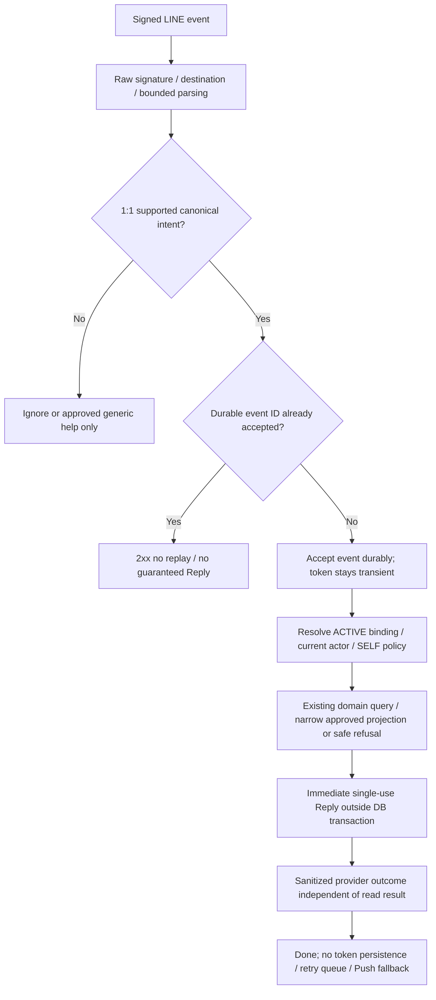

# Phase 17J.2A — Reactive Messaging Decision Pack / First Command Boundary

- วันที่ตรวจ: 2026-10-07; source baseline: `adebb1a`; working tree สะอาดก่อนเริ่ม
- **17J.2A — DECISION PACK COMPLETE / OWNER DECISIONS REQUIRED**
- **17J.2B — NOT STARTED**; **17J.2 runtime — NOT IMPLEMENTED**
- ทุกข้อเสนอในเอกสารนี้คือ **RECOMMENDATION — NOT OWNER APPROVED** จนมี owner closeout ระบุคำตอบ ผู้ตัดสินใจ และวันที่อย่างชัดเจน

## 1. Current status

| Phase | สถานะปัจจุบันและ authority |
| --- | --- |
| 17J.0 | CLOSED / ARCHITECTURE CONTRACT COMPLETE — [architecture contract](./PHASE_17J0_LINE_OA_LIFF_ARCHITECTURE_IDENTITY_CONTRACT.md), [ADR-0009](../adr/0009-demi-line-oa-liff-identity-and-messaging.md) |
| 17J.0B | CLOSED / OWNER DECISION CLOSED — Option C, [owner closeout §1–4](./PHASE_17J0B_MULTI_ROLE_RICH_MENU_DECISION_CLOSEOUT.md) |
| 17J.1 | IMPLEMENTED / AUTOMATED VERIFICATION COMPLETE — [current CONTEXT addendum](../CONTEXT.md), [implementation handoff](./PHASE_17J1_LINE_ACCOUNT_LINK_RICH_MENU_IMPLEMENTATION.md); verified against source below |
| 17J.2A | DECISION PACK COMPLETE / OWNER DECISIONS REQUIRED — documentation/source audit only |
| 17J.2B / 17J.2 runtime | NOT STARTED / NOT IMPLEMENTED |

External LINE provisioning, real LINE/mobile/device UAT และ production deployment ยังคง NOT CLAIMED / NOT EXECUTED ตาม handoff 17J.1. ไม่อนุมาน live readiness จาก automated evidence และไม่ได้รันทดสอบ runtime ใหม่ในงานนี้

## 2. Purpose and exact boundary

ปิดคำถาม product/privacy/interaction ที่ต้องทราบก่อนเขียน **Phase 17J.2B — Deterministic Reactive Messaging Technical Contract**. Pack นี้เสนอคำสั่งอ่านนัดหมายของตนหนึ่งคำสั่ง ไม่อนุมัติ disclosure เอง ไม่เขียน technical contract และไม่ implement runtime/schema/provider resource

เส้นทางที่สถาปัตยกรรมรับรอง: LINE webhook → verified ACTIVE binding → current DEMI User/Person/actor → current server policy → existing business query → privacy-approved projection → immediate Reply. LINE เป็น transport/presentation; Appointment และ Patient SELF เป็นเจ้าของข้อมูลและกฎ ไม่สร้าง appointment domain ที่สองใน LINE

## 3. Repository/source audit and evidence register

อ่านเอกสารที่ระบุด้านล่างและตรวจ implementation/policy/schema/routes/tests ที่เกี่ยวข้อง ใช้ current source เป็นหลักฐานพฤติกรรม ไม่ใช้ legacy repository. Test source แสดง assertions ที่มีอยู่ **ไม่ใช่ผลการรันทดสอบใน 17J.2A**

| Evidence | Source ที่ตรวจและข้อเท็จจริง |
| --- | --- |
| E01 | [CONTEXT](../CONTEXT.md), [ADR-0009 Decision 1–8](../adr/0009-demi-line-oa-liff-identity-and-messaging.md), [17J.0 §11, §15–19](./PHASE_17J0_LINE_OA_LIFF_ARCHITECTURE_IDENTITY_CONTRACT.md): dedicated Provider/identity; current authorization; deterministic/stateless interaction; reactive appointment fields ยัง OPEN |
| E02 | [17J.0B §1–4](./PHASE_17J0B_MULTI_ROLE_RICH_MENU_DECISION_CLOSEOUT.md), [17J.1 contract J1-07/J1-15/J1-17](./PHASE_17J1_LINE_ACCOUNT_LINK_RICH_MENU_IMPLEMENTATION_CONTRACT.md), [17J.1 handoff Reachability, webhook, and Option C / Runtime review corrections](./PHASE_17J1_LINE_ACCOUNT_LINK_RICH_MENU_IMPLEMENTATION.md): menu preference ไม่ใช่ authority; durable acceptance และ deferred reconciliation |
| E03 | [webhook route](../../app/api/line/webhook/route.ts), [webhook service](../../src/modules/line/services/line-webhook-service.ts), [schemas](../../src/modules/line/schemas/line-schemas.ts), [signature adapter](../../src/modules/line/adapters/line-webhook-security.ts): raw-byte verification/destination validation; supported events แคบ; per-event receipt/effect transaction |
| E04 | [Messaging client](../../src/modules/line/adapters/line-messaging-client.ts), [scheduler](../../src/modules/line/transport/line-reconciliation-scheduler.ts), [reconciler](../../src/modules/line/services/line-menu-reconciler.ts), [catalog](../../src/modules/line/rich-menu/catalog.ts), [deep-link builder](../../src/modules/line/services/line-deep-link-builder.ts): Rich Menu only; no Reply/Push; existing URLs เป็น account LIFF root หรือ authorized web workspace |
| E05 | [account service](../../src/modules/line/services/line-account-service.ts), [reachability service](../../src/modules/line/services/line-reachability-service.ts), [eligibility service](../../src/modules/line/services/line-eligibility-service.ts), [schema](../../prisma/schema.prisma), [LINE migration](../../prisma/migrations/20261006120000_line_account_linking_rich_menu/migration.sql): ACTIVE = `unlinkedAt IS NULL`; ACTIVE uniqueness/conflict guard; cleanup locator ไม่ใช่ binding authority |
| E06 | [17D.0 Owner-approved contract / §20 Decision-to-contract mapping](./PHASE_17D0_APPOINTMENT_INTERACTION_CONTRACT_CONSOLIDATION.md), [17D.1 implementation](./PHASE_17D1_APPOINTMENT_INTERACTION_IMPLEMENTATION.md), [appointment service](../../src/modules/appointments/services/appointment-service.ts), [appointment policy](../../src/modules/appointments/policies/appointment-policy.ts), [definitions](../../src/modules/appointments/domain/appointment-definitions.ts): acknowledgement/request/canonical status แยกกัน; no Patient direct cancellation/reschedule |
| E07 | [Patient SELF policy](../../src/modules/patient-self/policies/patient-self-policy.ts), [SELF query](../../src/modules/patient-self/services/patient-self-query-service.ts), [care query](../../src/modules/patient-self/services/patient-self-care-query-service.ts): persisted User ACTIVE/PATIENT/exact Person/own relationship; current appointment history DTO กว้างกว่าข้อมูลที่ควรส่ง LINE |
| E08 | [appointment root](../../app/app/personal/appointments/page.tsx), [relationship list](../../app/app/personal/appointments/[relationshipId]/page.tsx), [detail](../../app/app/personal/appointments/[relationshipId]/[appointmentId]/page.tsx), [page context](../../src/modules/patient-self/transport/patient-self-care-page-context.ts), [date presentation](../../app/app/personal/patient-self-care-presentation.tsx): authenticated server reads; root เป็น Hospital chooser; Thai datetime display Asia/Bangkok |
| E09 | [SELF query tests](../../src/modules/patient-self/services/patient-self-query-service.test.ts), [SELF care tests](../../src/modules/patient-self/services/patient-self-care-query-service.test.ts), [SELF policy tests](../../src/modules/patient-self/policies/patient-self-policy.test.ts), [appointment service tests](../../src/modules/appointments/services/appointment-service.test.ts), [PostgreSQL appointment tests](../../tests/integration/appointments.integration.test.ts): ownership denial, history paging/projection, independent acknowledgement, atomic request review |
| E10 | [webhook tests](../../src/modules/line/services/line-webhook-service.test.ts), [route tests](../../app/api/line/webhook/route.test.ts), [deep-link tests](../../src/modules/line/services/line-deep-link-builder.test.ts): malformed/unsupported siblings, duplicate no-op, revoked workspace denial, response/scheduling boundary และ allowlisted navigation |

### Evidence conflicts / gaps

1. ADR-0009 owner addendum, 17J.0 CURRENT addendum และ 17J.0B §7 ยังกล่าวว่า 17J.1 runtime NOT IMPLEMENTED ในเอกสารที่เขียนก่อน implementation. เป็น **documentation chronology/status conflict** กับ current CONTEXT, 17J.1 handoff และ source ที่มี runtime จริง ใช้หลักฐานใหม่เป็นสถานะปัจจุบัน; ไม่เปิด architecture หรือ Option C ใหม่ และไม่แก้เอกสารเก่าข้าม scope งานนี้
2. Immediate Reply กับ deferred provider work มี lifecycle tension (รายละเอียด §11) ไม่ใช่ข้อพิสูจน์ว่า 17J.1 ผิด เพราะ reconciliation มี durable repair แต่ Reply ไม่มี token ที่เก็บไว้ส่งภายหลังได้
3. ยังไม่มี exact upcoming SELF query, appointment navigation intent ใน builder, business postback action, receipt enum สำหรับ reactive command หรือ Reply method. เป็น **implementation gaps ตาม phase boundary** ไม่ใช่ข้ออนุมัติให้ implement ใน 17J.2A

## 4. Current LINE runtime evidence

`POST /api/line/webhook` เรียก `processLineWebhookRequest`; อ่าน body สูงสุด local 1 MiB, verify signature ก่อน decode/parse และตรวจ configured bot destination. Supported events คือ user-sourced follow/unfollow และ postback marker `DEMI_LINE_WORKSPACE_SWITCH_V1` เท่านั้น. Message text/generic postback/group/room ไม่ได้เป็น business command; unsupported events ไม่มี receipt

`persistProviderEvent` สร้าง unique `LineWebhookEventReceipt` และ reachability/preference effect ใน serializable transaction ต่อ event. P2002 ที่ตรวจพบ receipt เดิมให้ DUPLICATE/no-op. Receipt มี event ID/type/occurredAt/acceptedAt/outcome เท่านั้น; enum ปัจจุบันมี FOLLOW, UNFOLLOW, RICHMENUSWITCH และ outcomes APPLIED, STALE, IGNORED. ไม่มี token, payload, reply outcome หรือ delivery intent. `replyToken` เป็น optional schema field แต่ไม่ได้ถูกใช้หรือ persist; `isRedelivery` ไม่ใช่ authority/dedup key

Route คืน 200 หลัง durable processing พร้อม counters และ register `after()` สำหรับ binding reconciliation; ไม่ await Messaging API. DB acceptance failure ให้ 503; invalid signature/destination ให้ 401. Provider failure ภายหลังไม่ rollback receipt/authority และ menu มี lazy/operator repair

Workspace preference ต้องมี known alias, SUCCESS, exact current eligible-set menu และ current ACTIVE User; timestamp เก่าถูก ignore, equal-time conflict clear preference. Catalog มี URI และ native richmenuswitch actions ไม่มี “ตรวจสอบนัดหมาย”. Messaging client มีเฉพาะ Rich Menu operations ไม่มี Reply/Push method

Binding resolution ใช้ verified subject เป็น locator ไป ACTIVE binding เท่านั้น ไม่ใช้ unlinked cleanup locator, retained fingerprint หรือ reachability เป็น Patient authority. Follow/unfollow ไม่ link/unlink User. Current eligible-role projection อาจใช้ SELF context เพื่อแสดง PATIENT menu แต่ command ต้องตรวจ SELF policy/persistence ใหม่ ไม่ trust projection หรือ preference

## 5. Current Appointment / Patient SELF evidence

Canonical `PatientAppointment` ผูก `PatientHospitalRelationship`, `scheduledAt` เป็น `DateTime @db.Timestamptz(3)`, status มี SCHEDULED, COMPLETED, CANCELLED, NO_SHOW. ไม่มี stored appointment timezone/calendar-day หรือ upcoming status. `updatedAt` เป็น version ของ interactions; acknowledgement ไม่เปลี่ยน status. Cancellation request PENDING/REJECTED/SUPERSEDED ไม่ยกเลิกนัด; approval ทำ canonical cancellation และ request disposition atomically ตาม 17D.1

`assertPatientSelfReadPolicy` ตรวจ PATIENT และ actor identifiers/capability; **policy อย่างเดียวไม่พิสูจน์ ownership/current account**. `ownPatientWhere` จึงตรวจ exact Person ↔ User ACTIVE และ persisted PATIENT role; `resolveOwnPatientRelationshipContext` ตรวจ relationship ของ PatientProfile คนเดิม. ไม่รับ relationship จาก postback. SELF context/relationship navigation อ่าน own Hospitals ได้ทุก operational status รวม SUSPENDED/PENDING_VERIFICATION; test “resolves all own Hospital relationships independently of Hospital operational status” ยืนยัน. ไม่มี ACTIVE relationship flag ที่จะนำมาเดาเพิ่มใน SELF read นี้

`getOwnPatientAppointmentHistory` จำกัดหนึ่ง relationship, ทุก status/เวลา, `scheduledAt desc, id desc`, page 50 + lookahead 1. จึงเอาแค่รายการแรกหรือกรองแค่หน้าแรกมาใช้เป็น next appointment ไม่ได้. Detail ตรวจทั้ง appointment และ authorized relationship. `PatientSelfAppointmentItem` รวม IDs, locationDetail, responsibleDisplayName/profession, osmAtCreationDisplayName, acknowledgement และ cancellationRequests; **ห้ามส่ง DTO ทั้งก้อนให้ LINE**. Hospital name อยู่ใน relationship context ไม่ใช่ item โดยตรง

**RECOMMENDATION — NOT OWNER APPROVED:** 17J.2B กำหนด narrow application query/projection ในเจ้าของ Patient SELF/Appointment โดย reuse ownership/policy/status source; LINE รับเฉพาะ approved result/explicit mapper. Domain เลือก nearest จาก persisted SELF scope โดยไม่ scrape web page, filter history page แรก, loop fetch ทุก history หรือทำ rules/DB access ซ้ำใน LINE. Internal stable tie-break locator ใช้ได้เฉพาะ server ไม่ serialize/log

## 6. Candidate reactive-intent inventory

| Candidate | Source / disposition |
| --- | --- |
| ตรวจสอบนัดหมาย — PATIENT SELF upcoming summary | E06–E09: existing authoritative read; **RECOMMENDATION — NOT OWNER APPROVED** สำหรับ first slice |
| Minimal help / กลับเมนู | E01/E04: no Patient data; support UX candidate ตาม Q13 ไม่ใช่ business domain ใหม่ |
| Account link/manage และ workspace switch | มีจริงใน 17J.1 (E02–E05); preserve ไม่เรียกว่า conversational business command ใหม่ |
| PATIENT acknowledgement/cancellation request | มี web semantics (E06) แต่ **excluded from first reactive tranche**; การมี API/domain ไม่ใช่ chat approval |
| OSM/HOSPITAL roster หรือ appointment commands | Work authority มีจริง แต่ไม่มี approved chat projection/scope interaction; deferred ไม่ invent capabilities |
| Family, medication, clinical, reminders, free-form chatbot | ไม่มี first-slice approval; out of scope และ gates เดิมคงอยู่ |

## 7. Recommended first tranche

**RECOMMENDATION — NOT OWNER APPROVED:** READ ONLY — PATIENT SELF “ตรวจสอบนัดหมาย”, deterministic Rich Menu business postback อย่างเดียว, 1:1 source, zero conversation state. เลือกนัด SCHEDULED ที่ใกล้ที่สุดหนึ่งรายการจากทุก own relationship ที่ policy เดิมอนุญาต ณ เวลา query; เผยเฉพาะ date/time/Hospital display name/high-level status หาก Q03 ได้รับการอนุมัติ พร้อม “ดูนัดหมายทั้งหมด” ไปหน้ารายการเดิม

ข้อความตัวอย่างสำหรับ review เท่านั้น: “นัดหมายถัดไปของคุณ\nวันที่ … เวลา … (เวลาไทย)\nโรงพยาบาล …\nสถานะ: นัดหมายแล้ว”. ไม่ใช้ type/notes เพื่อแต่งข้อความ ไม่บอกว่าเป็นการยืนยันเข้าร่วม ไม่มี mutation และไม่สร้างคำสั่ง/marker/assets จริงในงานนี้

## 8. J2-Q01..J2-Q14 decision table

คำถาม OPEN ต้องมี owner answer ก่อน 17J.2B. CLOSED หมายถึง boundary เดิมที่มีหลักฐานรับรองแล้ว **ไม่ใช่ approval ใหม่ของ pack**. ทุก recommendation ในตารางคือ **RECOMMENDATION — NOT OWNER APPROVED**; owner อาจระบุ alternative ภายใน security invariants เดิม

| ID / owner question | Evidence / options | Recommendation และเหตุผล | Privacy/security impact / implementation consequence | Exact status |
| --- | --- | --- | --- | --- |
| J2-Q01 เริ่ม domain ใด? | E01/E06/E07: A SELF appointment only; B PATIENT+OSM/HOSPITAL; C generic multi-domain; D owner-defined | **A** มี read path จริงและคุณค่าผู้ใช้โดยไม่เปิดหลาย Patient | ลด operator-data disclosure; หนึ่ง business intent เท่านั้น | **OPEN / OWNER DECISION REQUIRED** |
| J2-Q02 เรียกคำสั่งอย่างไร? | E03/E04: A Rich Menu/postback only; B postback+tiny exact-text allowlist; C free-form/NLU; D other | **A** ลดการเดา intent; B พิจารณาแยกภายหลัง | Static versioned intent marker only ไม่มี role/resource/PII. C ขัด no-NLU boundary ต้องมี separate future contract; 17J.2B กำหนด exact parser/marker ต่างจาก workspace switch | **OPEN / OWNER DECISION REQUIRED**; no generic NLU **CLOSED — E01** |
| J2-Q03 ส่ง appointment fields ใดใน LINE? | E01 §18/E07: A status-only; B date/time/Hospital/high-level status; C เพิ่ม type/duration/locationType; D explicit projection | **B** เฉพาะ nearest หนึ่งรายการ ช่วยจำวันไปโรงพยาบาลโดยไม่ต้องเปิด UI หลายขั้น; A เป็นทางเลือก minimization สูงสุด; ไม่แนะนำ C | B ยังเผย care association และเวลาใน chat/notification preview/screenshots/shared device. Owner/privacy ต้องรับรอง exact fields; ไม่มี approval = ไม่เผย detail; allowlist projection ตาม §9 | **OPEN / REQUIRED OWNER PRIVACY DECISION** |
| J2-Q04 “upcoming” หมายถึงอะไร/ข้าม Hospital หรือไม่? | E06–E09: A nearest future SCHEDULED ทุก own relationships; B today/day window; C bounded list/window; D owner-defined | **A:** `status=SCHEDULED`, `scheduledAt >= server query now` inclusive, ascending scheduledAt then id, take 1 across all own eligible relationships; no arbitrary 90-day cap | Exclude CANCELLED/COMPLETED/NO_SHOW. Pending/rejected/superseded request และ acknowledgement ไม่เปลี่ยน eligibility. Bangkok display only; no role/Hospital precedence. Narrow source query ต้องกำหนด exact selection (§5) | **OPEN / OWNER DECISION REQUIRED**; canonical status/request meaning **CLOSED — E06** |
| J2-Q05 ถ้าไม่มีนัดที่เข้าเกณฑ์ตอบอย่างไร? | E07 history ≠ upcoming: A “ไม่พบนัดหมายที่กำลังจะมาถึง”; B same + navigation; C other | **B:** “ไม่พบนัดหมายที่กำลังจะมาถึง\nดูรายการนัดหมายได้ที่ «ดูนัดหมายทั้งหมด»” หาก Q06 อนุมัติ link; otherwise A | ใช้เฉพาะ authorized successful empty result; ไม่แปล missing authority/DB failure เป็น empty; ไม่สื่อไม่มีประวัติ/ลบข้อมูล | **OPEN / OWNER COPY DECISION REQUIRED** |
| J2-Q06 ออกจาก chat ไปดูรายละเอียดอย่างไร? | E04/E08: A inside chat only; B bounded details/list link; C wait for 17J.3; D other | **B:** label “ดูนัดหมายทั้งหมด” ไป existing `/app/personal/appointments`; root เป็น chooser ไม่ใช่ one-record detail | ไม่มี IDs/authority/token ใน URL. Builder ยังไม่มี intent นี้; 17J.2B ระบุ allowlisted extension เฉพาะ navigation ไป existing authorized web UI; ไม่ทำ complex LIFF | **OPEN / OWNER DECISION REQUIRED** |
| J2-Q07 unlinked/ineligible/suspended/stale/conflict/group? | E01/E03/E05/E07: A generic private refusal + account navigation; B silent all; C other safe copy | **A** สำหรับ recognized 1:1 intent; group/room silent ignore; รายละเอียด §10 | Generic denial ไม่บอก account/Patient/resource ของคนอื่น; recheck authority ก่อน query. Missing token = no reply/no fallback | **OPEN — COPY/INTERACTION**; fail closed/no group Patient data **CLOSED — E01** |
| J2-Q08 multi-role ทำคำสั่ง PATIENT ได้เมื่ออยู่ workspace อื่นหรือไม่? | E02 §3/E06/E07: A current SELF authority independent of selected menu; B menu-dependent; C other | **A** เมื่อ exact command ถูกส่งและ SELF ปัจจุบัน valid แม้ selected OSM/HOSPITAL; ไม่ switch role หรือ precedence | Client role claims ignored; stale/copied postback expands zero authority; B ใช้เป็น authorization ไม่ได้ | **CLOSED / EXISTING OWNER-APPROVED AUTHORITY BOUNDARY — E02/E06**; ไม่เปิด Option C ใหม่ |
| J2-Q09 Reply lifecycle ต้องรักษาอะไร? | ADR-0009 Decision 5, E01/E02/E04; official reference §11 | ใช้ event replyToken immediately, once, in memory only; no X-Line-Retry-Key for Reply, no Push fallback, no exactly-once claim, domain read success แยก provider outcome | ไม่ persist/reuse token. Immediate short-lived transport vs after-response durable repair ต้องแก้ใน technical contract โดยไม่ assume scheduler suitability | **CLOSED / EXISTING ARCHITECTURE BOUNDARY**; scheduling/timing mechanics **OPEN / 17J.2B TECHNICAL DESIGN REQUIRED** |
| J2-Q10 duplicate/redelivery/repeated tap/Reply failure? | E03/E05/E10: A consume durable event once with best-effort reply; B replay reply on every redelivery; C other | **A** duplicate event ID no query/reply replay; unseen redelivery อาจเป็น first accept แต่ไม่รับประกัน Reply; new tap/new event ID = new authorized read | หลัง receipt durable แล้ว provider failure/crash ไม่เปิด receipt ซ้ำ; user may tap again. ไม่สร้าง mutation idempotency framework/delivery queue; §11 ระบุ lost-reply tradeoff | **OPEN / OWNER DELIVERY-UX DECISION REQUIRED**; existing duplicate no-effect **CLOSED — E02/E03** |
| J2-Q11 ต้องมี conversation state หรือไม่? | E01 initial stateless UX; A zero state; B multi-message session; C other | **A:** tap → lookup → reply → done | ไม่มี pending question/session/wizard/chat OTP/HN/National-ID lookup. Existing account action intents/menu preference/event receipts ไม่ใช่ conversation state | **CLOSED / EXISTING INITIAL STATELESS BOUNDARY — E01**; future multi-message requires separate contract |
| J2-Q12 log/audit อะไรบ้าง? | E01 privacy/E03 receipt/E05 link audit/E07 read path: A sanitized telemetry without clinical read audit; B durable every-read audit; C other approved policy | **A** correlation ID, permitted event ID, canonical intent, outcome/category, duration เท่านั้น | No raw text/postback/subject/tokens/PII/appointment/resource IDs/clinical data. Event ID access/retention ตาม existing policy; pack ไม่ขยาย retention. No evidence ordinary successful SELF read requires AuditEvent; lifecycle audits unchanged | **OPEN / OWNER OBSERVABILITY DECISION REQUIRED**; existing no-sensitive-logging boundary **CLOSED — E01** |
| J2-Q13 unsupported text/postback/help? | E01/E03/E04: A silent ignore; B fixed minimal help for user text, unknown postback ignore; C other deterministic behavior | **B:** “กรุณาเลือกเมนู DEMI ด้านล่างเพื่อใช้งาน” once per accepted text event, no echo/no intent guessing; unknown postback silent ignore | Text ไม่ route business; group/room/media/system/invalid events ignored. Workspace-switch marker ยังคง dispatch 17J.1 ไม่ใช่ unknown/business command. Help acceptance/dedup ต้องกำหนดใน 17J.2B ไม่เพิ่ม state | **OPEN / OWNER HELP-UX DECISION REQUIRED** |
| J2-Q14 first slice มี mutation หรือไม่? | E06 web interactions approved ≠ chat approval: A READ ONLY; B add acknowledgement/request etc.; C other | **A** scope เล็ก ทดสอบ authority/disclosure/transport ก่อน | No acknowledge/cancel request/reschedule/create/complete/no-show/coordination; no new domain side effects/read clinical audit automatically. B ต้องมี separate action contract ไม่ inherit web permission เป็น chat UX | **OPEN / OWNER FIRST-SLICE SCOPE DECISION REQUIRED** |

### Q04 precision and non-inherited rules

Server query ใช้หนึ่ง captured current instant; ไม่ใช้ webhook timestamp เป็น business cutoff และไม่ใช้ “ตั้งแต่เที่ยงคืนวันนี้”. Appointment ตรง boundary ถูก include; นัดที่เริ่มก่อน now แม้ duration ยังไม่จบถูก exclude. Equal scheduledAt เลือก internal id ascending อย่าง deterministic โดยไม่ส่ง ID ไป LINE. ไม่มี count/รายการ Hospital อื่นใน reply; ทางดูรายการทั้งหมดอยู่หน้า web

Scope ตาม SELF เดิมรวม own relationships โดยไม่เพิ่ม Hospital ACTIVE filter หรือ Family 90-day SCHEDULED/CANCELLED grant window. หาก owner ต้องการต่างจากนี้ให้ตอบ Q04 ชัดเจนก่อน technical contract. Missing PatientProfile/ไม่มี own relationship = ineligible response Q07; own relationship มีแต่ไม่มี matching appointment = empty Q05. การอ่าน own relationship ของ suspended Hospital ยังคงได้ตาม policy ที่ตรวจ ไม่สร้าง operational Hospital authority

Asia/Bangkok เป็น **display-time choice** ตาม `formatPatientDateTime`, locale `th-TH`, dateStyle medium/timeStyle short (Thai calendar ตาม formatter), ใช้คำว่า “เวลาไทย”. Stored scheduledAt เป็น absolute instant; ไม่อ้างว่า schema เก็บ Bangkok business timezone หรือ reminder scheduling rule. LINE ไม่ import UI formatter จาก higher layer; 17J.2B ระบุ domain-safe presentation reuse โดยไม่เปลี่ยน source instant

## 9. Privacy/disclosure matrix

**ทุก candidate disclosure ยัง NOT OWNER APPROVED.** Authenticated web allowlist หรือ Family grant disclosure ไม่ใช่ LINE approval. Rich Menu/postback มี intent marker เท่านั้น; ไม่มี Patient fields ทุกตัวเลือก

| Field/content | A status-only | B minimal next appointment (recommended) | C broader | ข้อจำกัด/impact |
| --- | --- | --- | --- | --- |
| Upcoming existence / authorized empty | Candidate | Candidate | Candidate | แม้ A ก็เผยว่ามี care appointment; ต้อง owner review |
| Date/time from scheduledAt | Exclude | Candidate | Candidate | Exact Thai display/เวลาไทย; reveals schedule |
| Hospital display name | Exclude | Candidate | Candidate | Owning relationship Hospital; reveals care association; no code/ID/HN |
| High-level canonical status | Exclude enum; existence copy only | Candidate “นัดหมายแล้ว” | Candidate | Not attendance confirmation; no pending-request/acknowledgement narrative |
| Appointment type/duration/locationType | Exclude | Exclude | Candidate only if explicitly chosen | มากกว่าข้อมูลจำเป็น; not recommended for first slice |
| National ID, HN, legal name, phone/address | Exclude | Exclude | Exclude | Not routine chat lookup/disclosure |
| appointment/relationship/User/Person/database IDs, hidden resource locators | Exclude | Exclude | Exclude | Internal selection only; no payload, link, log disclosure |
| locationDetail/free text, clinical note/diagnosis/medication/clinical data | Exclude | Exclude | Exclude | No approved LINE field; detailed sensitive workflows authenticated web/LIFF later |
| responsible staff/OSM identity/profession, creator | Exclude | Exclude | Exclude | Web DTO permission does not carry into chat |
| acknowledgement, cancellation requests/history, audit/version metadata | Exclude | Exclude | Exclude | Preserve canonical semantics internally; no interaction history in LINE |
| LINE subject/tokens/session/access/OTP/authority claims | Exclude | Exclude | Exclude | Transient verified boundary input only where necessary, never output/log |
| Constant allowlisted appointment-root link | Separate Q06 | Separate Q06 | Separate Q06 | No personalized query/fragment/ID/token; page reauthorizes |

Owner-defined D ต้องระบุแต่ละ field, rationale และ explicit privacy approval ใหม่. ไม่ใช้ D เป็นช่องอนุมัติ entire DTO. ถ้า B ไม่ผ่านให้ owner เลือก A หรือ narrow D; ทีมไม่ลด/เพิ่ม disclosure เองและไม่ implement ก่อน closeout

## 10. Chat vs LIFF / exception UX

Chat first slice มีเพียง read-only approved summary/empty/generic refusal/help; complex multi-input, sensitive detail และ appointment mutations อยู่ authenticated existing web UI หรือ later explicitly approved LIFF workflow. Existing appointment page มี actions ตาม 17D; navigation ไม่ใช่ chat mutation และไม่ขยาย permission

Builder ปัจจุบัน map OPEN_PATIENT_WORKSPACE → `/app/personal`, OPEN_WORK_WORKSPACE → `/app`; LINK/MANAGE/SWITCH → LIFF root ที่ endpoint `/line/account`. **ยังไม่มี appointment intent และไม่ใช่ generic LIFF router.** Q06-B เสนอ constant appointment-root URL ผ่าน centralized builder ในอนาคต เปิด existing web page ตาม session/login เดิม; ไม่อ้างว่า appointment screen เป็น LIFF workflow ที่ implement แล้ว ไม่ append appointment path เข้า account LIFF root โดยเดา lifecycle

**RECOMMENDATION — NOT OWNER APPROVED — Q07 response cases:**

| Current condition | Product behavior candidate |
| --- | --- |
| No ACTIVE binding | “ยังไม่สามารถตรวจสอบนัดหมายผ่าน LINE ได้ กรุณาเปิด «จัดการบัญชี DEMI» จากเมนู” พร้อม existing account navigation; ไม่บอกสถานะ account ของคนอื่น |
| User not ACTIVE; PATIENT role removed; missing/mismatched PatientProfile/own relationship; binding conflict | ใช้ refusal ข้อความเดียวกัน ไม่บอก suspended/role removed/conflict owner/Patient existence; no appointment query/disclosure; no auto-link/recovery/transfer |
| Stale/copied known business postback | Validate exact intent + current binding/actor/SELF; deny ถ้าไม่ valid, ถ้า valid ทำ same bounded current read; visible menu ไม่ขยาย authority |
| group/room แม้มี userId | Silent ignore Patient command; no lookup/reply containing Patient data/account-status inference |
| Successful authorized empty | Q05 wording เท่านั้น; แยกจาก ineligible |
| Query/infrastructure failure | “ขณะนี้ยังตรวจสอบนัดหมายไม่ได้ กรุณาลองใหม่ภายหลัง” ถ้ามี immediate token; no stack trace/internal error และไม่อ้าง empty |
| Missing/expired token หรือ Reply failure/uncertain transport | No delayed reply/Push; user ใช้เมนูใหม่หรือ existing web navigation ได้; ไม่ส่งข้อความที่สองเพื่อรายงาน failure ของ token เดิม |

## 11. Reactive Reply lifecycle and deduplication

Conceptual lifecycle **ไม่ใช่ approved implementation scheduling design**:

Diagram แสดง logical dependencies เท่านั้น ไม่เลือกตำแหน่ง HTTP 2xx เทียบ Reply call. Invalid request ไม่ผ่าน validation; transaction acceptance failure ไม่ใช่ successful acceptance. Multi-event request ต้องรักษา supported-sibling isolation/durable acceptance เดิม; 17J.2B ต้องกำหนด latency budget และ crash/timeout/missing token/concurrency behavior ให้ตรวจสอบได้

Accepted Reply boundary: ใช้ token ของ event นั้นทันที ครั้งเดียว ไม่ persist เพื่อ future delivery ไม่ reuse ไม่ใช้ X-Line-Retry-Key semantics และไม่ fallback Push. Domain read success ไม่ขึ้นกับ provider success; successful API response ไม่ใช่ exactly-once visible delivery. Official [Reply reference](https://developers.line.biz/en/reference/messaging-api/nojs/#send-reply-message) ตรวจ 2026-10-07: ใช้ภายในหนึ่งนาทีหลังรับ webhook; เกินนั้นไม่ guaranteed และต้องส่งเร็วที่สุด. Redelivered token มีข้อจำกัดเมื่อใช้แล้ว/ผ่านเวลาจาก event; platform eligibility ไม่ใช่ DEMI retry guarantee

**Architectural tension — OPEN / 17J.2B:** 17J.1 commit receipt/effect → schedule `after()` → return 2xx; deferred menu call มี durable state ให้ repair. Reply ต้อง token transient/short-lived; reuse scheduler/durable repair แบบเดิมอาจเสีย deadline หรือ crash หลัง receipt แล้วไม่มี Reply. Await Reply ก่อน 2xx ก็เปลี่ยน latency/provider-dependency boundary; token queue ก็ขัด no-persistence/no-delivery-queue scope. 17J.2A ไม่เลือก workaround/เพิ่ม storage/เปลี่ยน route. 17J.2B ต้องเขียน precise event acceptance + immediate transport lifecycle ที่ preserve foundation และระบุ tradeoff ก่อน implementation

**RECOMMENDATION — NOT OWNER APPROVED — Q10:**

| Situation | Intended first-slice semantics |
| --- | --- |
| Same durable webhookEventId | No duplicate query/business effect/Reply; 2xx. Receipt proves acceptance, not visible delivery |
| LINE redelivery with receipt present | Same duplicate rule regardless isRedelivery; never guaranteed Reply retry |
| LINE redelivery with no durable receipt | Can be first acceptance of eligible event; fresh authority/current query, immediate token only if usable; no retrospective delivery promise |
| User taps again, new event ID | New current authorized read/new token; not duplicate by text/intent/Patient or timestamp |
| Reply fails/expires/response ambiguous after receipt durable | Keep consumed event; sanitized provider outcome; no receipt reset, re-send, retry key, Push or domain rollback |
| Crash after durable acceptance before Reply | Reply may be lost; duplicate suppressed; user may initiate a new tap. Owner must accept this limitation or request separately bounded contract change |

Existing [webhook guide](https://developers.line.biz/en/docs/messaging-api/receiving-messages/#redeliver-a-webhook-that-failed-to-be-received) says duplicate detection uses event ID, redelivery can reorder and isn't guaranteed. Read-only command needs webhook deduplication but no business mutation idempotency ledger. Current receipt eventType enum cannot represent business intent/help; technical contract must acknowledge this gap explicitly without relabelling events RICHMENUSWITCH or writing migrations now

## 12. Security invariants (already accepted; not reopened)

- LINE source ID is a locator; only server-verified ACTIVE binding resolves exact DEMI User. No cleanup/history locator authority or client-selected actor
- Current persisted User ACTIVE, Person relation, PATIENT role and exact SELF scope re-evaluated every command; policy fail closed. Role/membership/scope never come from text/postback/URL
- presentationRole is UI preference only; preserve owner-approved Option C and no role precedence. OSM/HOSPITAL/ADMIN-only cannot acquire Patient authority; multi-role reads SELF only
- group/room Patient commands ignored safely even if a userId exists; no Patient data delivered there
- Postback contains canonical intent marker only; no IDs/PII/clinical fields/tokens/authority. Unknown text never grants business authority; no fuzzy/LLM/NLU router
- No National ID/HN/OTP requested in chat after linking; existing DEMI auth/link/recovery flow remains authoritative
- Minimum owner-approved projection only; no whole PatientSelfAppointmentItem. Target route rechecks authenticated SELF; route locator is not permission
- No Reply-token persistence/reuse/Push fallback, proactive/reminder semantics, exactly-once claim, or dependence of domain outcome on LINE availability
- No medication/adherence behavior, Family authority expansion or ADMIN operational Patient access; existing lifecycle audit/security constraints preserved

## 13. Explicit non-goals

งาน 17J.2A ไม่ทำ runtime Reply/Push, Rich Menu command/marker/assets/provisioning, LINE provider configuration/resources, schema/migrations, appointment mutation ใด ๆ, medication lookup/clinical replies, OSM/Hospital roster in chat, Family/caregiver expansion, persistent conversation/session/pending-question/wizard/state machine, National-ID/HN lookup/chat OTP, AI/LLM/NLU/generic chatbot

ไม่ทำ appointment/medication/follow-up reminders, scheduler, notification preferences/quiet hours, delivery retry queue/attempt persistence/generic notification framework, complex LIFF 17J.3, proactive delivery 17J.4, deployment, real-provider/mobile/device UAT. ไม่ run full unit/integration suite, Prisma migration/reset, Next.js build หรือ dev server

## 14. Dependencies on later phases / unchanged gates

17J.0 architecture → 17J.1 link + menus → **17J.2A owner decisions → 17J.2B technical contract → bounded 17J.2 implementation** → 17J.3 complex LIFF → 17J.4 proactive Push → 17J.5A automated integrated re-audit/UAT readiness → 17J.5B real OA/mobile/device UAT. ห้ามรวม tranche หรืออ้าง implementation จาก decision pack

17J.2B ต้องกำหนด parser/projection/query ownership, fresh actor/authorization/concurrency guarantees, event acceptance/dedup/Reply timing/error boundaries, safe telemetry และ focused verification contract ตาม owner choices. ไม่เริ่มในงานนี้

P17D-NOTIF-01 (events/recipient/time/stale/cancel/preferences/consent/retry), MED-02, medication delivery/adherence, Follow-up prospective source, P17F-L04/L05, Q5 real-data governance, parked 17E.2 consent, identity-history retention/erasure/future cross-account reconciliation, unlink/recovery copy gates, manual UAT และ deployment คงสถานะเดิม. การเลือก Q03 reactive disclosure ไม่ปิด proactive content/consent gate หรืออนุมัติ reminder

## 15. Owner decision checklist

ช่องว่างคือ OPEN ไม่ถือ default/recommendation/ไม่มีคำตอบเป็น approval. Owner closeout ต้องตอบทั้ง options และ exact projection/copy/selection/UX tradeoff; ระบุผู้ตัดสินใจ วันที่ และ authority evidence

- [ ] Q01: domain A/B/C/D: ______
- [ ] Q02: trigger A/B/D, exact-text alias ถ้ามีต้องระบุ separately: ______
- [ ] Q03 **required privacy approval**: A/B/C/D และ exact permitted field list: ______; รับทราบ chat/preview/shared-device exposure: ______
- [ ] Q04: status/time inclusive boundary/tie-break/take-one/all-own-Hospitals/window/display: ______; preserve canonical request semantics
- [ ] Q05: exact empty Thai copy และ link variant: ______
- [ ] Q06: navigation option/label/existing web route vs later LIFF: ______
- [ ] Q07: generic private refusal/account route, unavailable copy, silent group/room: ______
- [ ] Q10: duplicate no Reply replay และ accepted-event crash/lost-reply/new-tap tradeoff: ______
- [ ] Q12: minimal sanitized telemetry, permitted event ID handling/no ordinary clinical read AuditEvent: ______
- [ ] Q13: ignore vs fixed help; exact Thai copy; unknown postback/media behavior: ______
- [ ] Q14: **READ ONLY** หรือ separately bounded action-contract request: ______
- [x] Q08: presentation != authorization, current SELF and Option C — CLOSED under existing approved sources; no new role precedence
- [x] Q09: immediate single-use transient Reply/no Push fallback — CLOSED architecture; scheduling resolution remains technical dependency
- [x] Q11: zero persisted conversation state — CLOSED initial architecture; no new interaction state approval

## 16. GO / NO-GO for 17J.2B and validation

**GO — owner review/decision closeout ของ pack นี้. NO-GO — drafting a precise implementation-ready 17J.2B contract until OPEN owner choices above are explicitly closed, especially Q03 privacy, Q04 selection and Q10 lost-reply semantics. NO-GO — runtime/schema/provider work in this task.** Closed architecture items are cited and preserved; lifecycle tension becomes an explicit technical design obligation after owner closeout, not an excuse to implement early

17J.2A validation: ตรวจ relative Markdown targets และ local section references, strict UTF-8/Thai text, encoding/line endings ของ CONTEXT, accidental current-status contradictions, documentation-only changed-path allowlist, final diff และ `git diff --check`. Runtime tests/build/integration ไม่รัน; prior handoff results เป็น historical evidence เท่านั้น

Exact next step after owner decision closeout: **Phase 17J.2B — Deterministic Reactive Messaging Technical Contract**. งานนี้หยุดที่ 17J.2A
